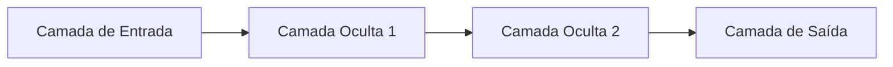

```markdown
# Tipos de Camadas: Entrada, Ocultas e Saída

As redes neurais artificiais são compostas por unidades fundamentais chamadas **camadas** (*layers*), que organizam e processam os dados em diferentes estágios do modelo. Compreender os tipos de camadas é essencial para entender como as redes neurais aprendem e realizam tarefas complexas, como geração de texto, imagens ou música. Neste tópico, vamos explorar os três principais tipos de camadas: **camada de entrada**, **camadas ocultas** e **camada de saída**.

---

## 1. Camada de Entrada (*Input Layer*)

A **camada de entrada** é o ponto inicial da rede neural, responsável por receber os dados brutos que serão processados. Cada neurônio dessa camada representa uma característica (ou *feature*) do dado de entrada.

- **Função:** Não realiza cálculos ou transformações; apenas repassa os dados para a próxima camada.
- **Exemplo:** Em um modelo de geração de texto, cada neurônio pode representar um token (palavra ou caractere) do texto de entrada. Em uma rede para imagens, cada neurônio pode corresponder ao valor de um pixel.

**Visualização:**
```
[ dado1 ]   [ dado2 ]   [ dado3 ]  ...  [ dadoN ]
    |           |           |               |
[ Neurônio1 ][ Neurônio2 ][ Neurônio3 ] ... [ NeurônioN ]
```

---

## 2. Camadas Ocultas (*Hidden Layers*)

As **camadas ocultas** são o núcleo do processamento em uma rede neural. Elas ficam entre a camada de entrada e a camada de saída, e são responsáveis por aprender representações intermediárias e complexas dos dados.

- **Função:** Cada neurônio em uma camada oculta recebe sinais das camadas anteriores, aplica uma função de ativação e transmite o resultado para a próxima camada.
- **Quantidade:** Uma rede pode ter uma ou várias camadas ocultas. Redes profundas (*deep neural networks*) possuem múltiplas camadas ocultas, permitindo a aprendizagem de padrões mais sofisticados.
- **Exemplo:** Em um modelo de geração de imagens, as camadas ocultas podem aprender a identificar bordas, formas e, posteriormente, objetos completos.

**Visualização:**
```
[ Camada de Entrada ] → [ Camada Oculta 1 ] → [ Camada Oculta 2 ] → ... → [ Camada Oculta N ]
```

- **Importância:** O número e o tamanho das camadas ocultas influenciam diretamente a capacidade da rede de modelar relações complexas nos dados. Camadas ocultas insuficientes podem limitar o aprendizado, enquanto camadas em excesso podem levar ao sobreajuste (*overfitting*).

---

## 3. Camada de Saída (*Output Layer*)

A **camada de saída** é a etapa final da rede neural, responsável por produzir o resultado do processamento.

- **Função:** Transforma as representações aprendidas nas camadas ocultas em uma resposta final, de acordo com a tarefa proposta (classificação, regressão, geração, etc.).
- **Exemplo:**  
  - Em um modelo de geração de texto, a camada de saída pode indicar a próxima palavra ou caractere a ser gerado.
  - Em um classificador de imagens, cada neurônio da camada de saída pode representar uma classe possível (gato, cachorro, etc.).
- **Função de Ativação:** A escolha da função de ativação na camada de saída depende do problema:
  - **Softmax:** Para classificação multiclasse.
  - **Sigmoid:** Para classificação binária.
  - **Linear:** Para tarefas de regressão.

**Visualização:**
```
[ ... Camadas Ocultas ... ] → [ Camada de Saída ]
```

---

## Resumo Visual



---

## Considerações Finais

- **Camada de Entrada:** Recebe e repassa os dados.
- **Camadas Ocultas:** Processam e extraem padrões dos dados.
- **Camada de Saída:** Produz o resultado final da rede.

A correta configuração e compreensão dessas camadas são fundamentais para o sucesso de qualquer aplicação de Inteligência Artificial Generativa, seja em JavaScript, TypeScript ou outras linguagens. Ao dominar esses conceitos, você estará apto a criar, ajustar e inovar em modelos de IA para geração de texto, imagens, música e muito mais no ecossistema web.
```
