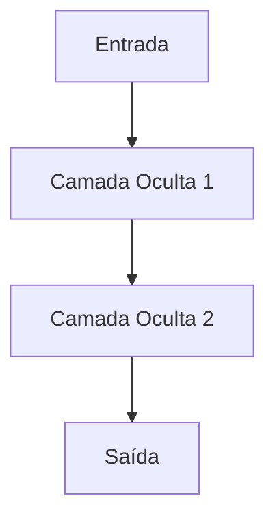

```markdown
# Componentes Básicos: Neurônios, Camadas e Conexões

As redes neurais artificiais são inspiradas no funcionamento do cérebro humano, sendo compostas por unidades fundamentais chamadas **neurônios artificiais**. Para entender como essas redes processam informações e aprendem padrões complexos, é essencial conhecer seus principais componentes: neurônios, camadas e conexões.

## Neurônios Artificiais

O **neurônio artificial** é a menor unidade funcional de uma rede neural. Ele simula, de forma simplificada, o comportamento de um neurônio biológico. Cada neurônio recebe um ou mais valores de entrada, realiza uma soma ponderada desses valores, adiciona um termo de viés (bias) e, em seguida, aplica uma função de ativação para produzir uma saída.

Matematicamente, o funcionamento de um neurônio pode ser representado por:

```
y = f(w₁x₁ + w₂x₂ + ... + wₙxₙ + b)
```

- `x₁, x₂, ..., xₙ`: Entradas do neurônio
- `w₁, w₂, ..., wₙ`: Pesos associados a cada entrada
- `b`: Viés (bias)
- `f`: Função de ativação (ex: ReLU, sigmoid, tanh)
- `y`: Saída do neurônio

A função de ativação é responsável por introduzir não-linearidade ao modelo, permitindo que a rede aprenda padrões complexos.

## Camadas (Layers)

Os neurônios são organizados em **camadas**. Cada camada é composta por vários neurônios que operam em paralelo. As redes neurais geralmente possuem três tipos principais de camadas:

- **Camada de Entrada (Input Layer):** Recebe os dados brutos do problema (ex: pixels de uma imagem, palavras de um texto).
- **Camadas Ocultas (Hidden Layers):** Realizam transformações intermediárias nos dados. O número e o tamanho dessas camadas determinam a capacidade da rede de aprender padrões complexos.
- **Camada de Saída (Output Layer):** Produz o resultado final da rede (ex: classificação, valor numérico, texto gerado).

A profundidade (número de camadas ocultas) e a largura (quantidade de neurônios por camada) são fatores importantes no design de redes neurais, influenciando sua capacidade de generalização e desempenho.

## Conexões e Pesos

Os **neurônios** de uma camada estão conectados aos neurônios da camada seguinte por meio de **conexões**. Cada conexão possui um **peso** associado, que determina a importância do sinal transmitido entre os neurônios.

Durante o treinamento da rede, esses pesos são ajustados por algoritmos de otimização (como o gradiente descendente) para minimizar o erro entre a saída prevista e a saída desejada. O processo de ajuste dos pesos é o que permite à rede aprender a realizar tarefas específicas, como reconhecimento de padrões, geração de texto ou imagens.

### Tipos de Conexões

- **Totalmente Conectada (Fully Connected / Dense):** Cada neurônio de uma camada está conectado a todos os neurônios da próxima camada.
- **Conexões Esparsas:** Em algumas arquiteturas, como redes convolucionais, cada neurônio se conecta apenas a uma parte dos neurônios da camada anterior, reduzindo a complexidade e focando em padrões locais.

## Resumo Visual



Cada seta representa múltiplas conexões entre neurônios de camadas adjacentes, cada uma com seu próprio peso.

## Conclusão

Os componentes básicos das redes neurais artificiais — neurônios, camadas e conexões — formam a base para a construção de modelos capazes de aprender e generalizar a partir de dados. Compreender esses elementos é fundamental para o desenvolvimento e aplicação de soluções de Inteligência Artificial Generativa, especialmente ao utilizar ferramentas como JavaScript e TypeScript no ecossistema web.

No próximo tópico, exploraremos como esses componentes se organizam em arquiteturas mais complexas, como as redes profundas (Deep Learning), e como são aplicados em modelos de linguagem e geração de conteúdo.
```
