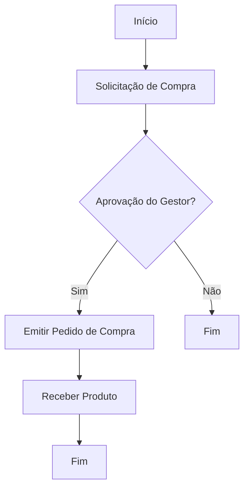

# Criação de Fluxogramas para Processos Empresariais

A utilização de fluxogramas é uma prática fundamental na modelagem, análise e otimização de processos empresariais. Eles permitem representar visualmente o fluxo de atividades, decisões e interações dentro de uma organização, facilitando a compreensão, comunicação e melhoria contínua dos processos.

## O que é um Fluxograma?

Um **fluxograma** é uma representação gráfica de um processo, onde cada etapa é simbolizada por figuras geométricas padronizadas (como retângulos, losangos e setas), conectadas de acordo com a sequência lógica das operações. Ele serve para ilustrar como as tarefas são executadas, quais decisões precisam ser tomadas e como as informações fluem de uma etapa para outra.

## Por que Utilizar Fluxogramas em Processos Empresariais?

A criação de fluxogramas traz diversos benefícios para as empresas, tais como:

- **Clareza e padronização:** Facilita o entendimento do processo por todos os envolvidos, independentemente do nível de conhecimento técnico.
- **Identificação de gargalos:** Ajuda a localizar etapas redundantes, ineficientes ou desnecessárias.
- **Facilidade de treinamento:** Novos colaboradores podem aprender rapidamente como os processos funcionam.
- **Base para automação:** Serve como documentação para a implementação de sistemas automatizados.
- **Apoio à melhoria contínua:** Permite analisar e propor melhorias de forma visual e colaborativa.

## Elementos Básicos de um Fluxograma

Os principais símbolos utilizados em fluxogramas são:

- **Elipse/Ovóide:** Indica o início ou fim do processo.
- **Retângulo:** Representa uma atividade ou tarefa.
- **Losango:** Indica um ponto de decisão (sim/não, verdadeiro/falso).
- **Setas:** Mostram a direção do fluxo do processo.
- **Paralelogramo:** Entrada ou saída de dados/informações.

Exemplo de símbolos:

| Símbolo         | Significado         |
|-----------------|--------------------|
|  | Início/Fim         |
|  | Processo/Tarefa    |
|  | Decisão            |
|  | Direção do fluxo   |

## Passos para Criar um Fluxograma Empresarial

1. **Defina o objetivo do processo:** Entenda claramente qual processo será representado e qual o seu propósito.
2. **Liste as etapas do processo:** Identifique todas as atividades, decisões e pontos de entrada/saída.
3. **Organize a sequência lógica:** Determine a ordem em que as etapas ocorrem.
4. **Escolha os símbolos adequados:** Utilize os símbolos padronizados para cada tipo de ação.
5. **Desenhe o fluxograma:** Pode ser feito à mão, em softwares de desenho ou ferramentas específicas (como Lucidchart, Draw.io, Visio).
6. **Revise com a equipe:** Compartilhe o fluxograma com os envolvidos para validar e ajustar conforme necessário.
7. **Documente e atualize:** Mantenha o fluxograma atualizado sempre que houver mudanças no processo.

## Exemplo Prático: Fluxograma de Aprovação de Compras

Neste exemplo, o processo começa com a solicitação de compra, passa por uma decisão de aprovação do gestor e, se aprovado, segue para a emissão do pedido e recebimento do produto.

## Boas Práticas na Criação de Fluxogramas

- **Seja objetivo:** Evite excesso de detalhes que possam dificultar a leitura.
- **Use nomes claros:** Descreva cada etapa de forma simples e direta.
- **Padronize os símbolos:** Utilize sempre os mesmos símbolos para as mesmas ações.
- **Mantenha o fluxo da esquerda para a direita ou de cima para baixo:** Isso facilita a leitura.
- **Revise periodicamente:** Atualize o fluxograma sempre que o processo mudar.

## Ferramentas para Criar Fluxogramas

- [Draw.io (diagrams.net)](https://www.diagrams.net/)
- [Lucidchart](https://www.lucidchart.com/)
- [Microsoft Visio](https://www.microsoft.com/pt-br/microsoft-365/visio/flowchart-software)
- [Google Drawings](https://docs.google.com/drawings/)

## Conclusão

A criação de fluxogramas é uma habilidade essencial para profissionais que desejam otimizar processos empresariais. Eles promovem transparência, eficiência e colaboração, sendo uma ferramenta indispensável para a gestão e melhoria contínua nas organizações. Ao dominar a elaboração de fluxogramas, você estará mais preparado para analisar, documentar e aprimorar processos, contribuindo para o sucesso do negócio.