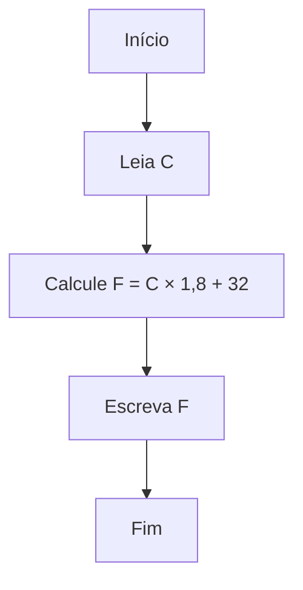
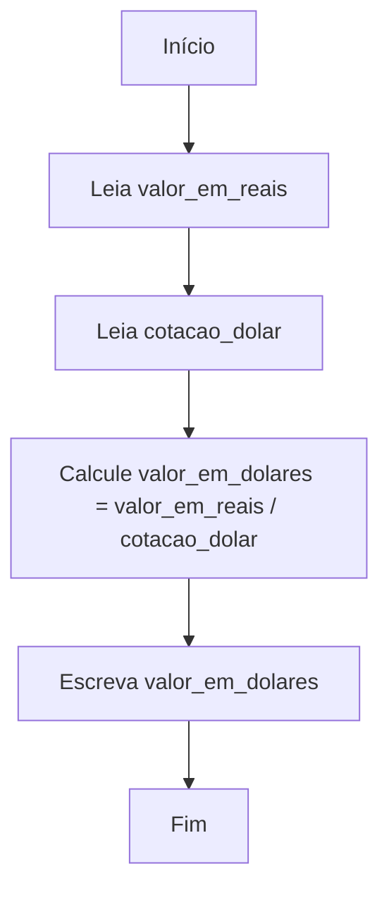

# Exercícios de Algoritmos para Conversão de Unidades

A conversão de unidades é um dos temas mais comuns e úteis em lógica de programação, pois envolve o uso de variáveis, operadores aritméticos e entrada/saída de dados. Exercícios desse tipo ajudam a fixar conceitos fundamentais e a praticar a criação de algoritmos eficientes e claros. A seguir, apresentamos exemplos práticos e exercícios de algoritmos para conversão de unidades, como temperatura e moedas, utilizando pseudocódigo e fluxogramas.

---

## 1. Conversão de Temperatura

### Exemplo 1: Celsius para Fahrenheit

**Fórmula:**  
F = C × 1,8 + 32

**Pseudocódigo:**
```
Início
    Leia C  // temperatura em Celsius
    F ← C × 1,8 + 32
    Escreva "Temperatura em Fahrenheit: ", F
Fim
```

**Fluxograma:**



---

### Exercício 1

**Enunciado:**  
Crie um algoritmo que leia uma temperatura em Fahrenheit e converta para Celsius.

**Fórmula:**  
C = (F - 32) / 1,8

**Desafio:**  
Implemente o algoritmo em pseudocódigo e desenhe o fluxograma correspondente.

---

## 2. Conversão de Moedas

### Exemplo 2: Real para Dólar

**Suponha:**  
Cotação do dólar = 5,00

**Pseudocódigo:**
```
Início
    Leia valor_em_reais
    Leia cotacao_dolar
    valor_em_dolares ← valor_em_reais / cotacao_dolar
    Escreva "Valor em dólares: ", valor_em_dolares
Fim
```

**Fluxograma:**



---

### Exercício 2

**Enunciado:**  
Crie um algoritmo que leia um valor em dólares e a cotação do euro, e converta o valor para euros.

**Fórmula:**  
valor_em_euros = valor_em_dolares × cotacao_euro

**Desafio:**  
Implemente o algoritmo em pseudocódigo e desenhe o fluxograma correspondente.

---

## 3. Exercícios Propostos

### Exercício 3: Conversão de Quilômetros para Milhas

**Fórmula:**  
milhas = km × 0,621371

**Tarefa:**  
Crie um algoritmo que leia uma distância em quilômetros e converta para milhas.

---

### Exercício 4: Conversão de Minutos para Horas e Minutos

**Tarefa:**  
Crie um algoritmo que leia um valor em minutos e exiba o resultado em horas e minutos (por exemplo, 130 minutos = 2 horas e 10 minutos).

---

## 4. Dicas para Resolver Exercícios de Conversão

- **Identifique as variáveis:** O que será lido e o que será calculado?
- **Aplique a fórmula correta:** Certifique-se de usar a fórmula adequada para a conversão.
- **Organize o algoritmo:** Siga a sequência: entrada de dados, processamento e saída.
- **Teste com exemplos reais:** Use valores conhecidos para verificar se o algoritmo está correto.

---

## 5. Conclusão

Exercícios de conversão de unidades são excelentes para praticar lógica de programação, pois envolvem leitura de dados, cálculos e apresentação de resultados. Ao dominar esses algoritmos, você estará mais preparado para resolver problemas do dia a dia e avançar para desafios mais complexos na programação.

---

**Pratique!**  
Tente resolver os exercícios propostos e, se possível, implemente-os em uma linguagem de programação de sua escolha após criar o pseudocódigo e o fluxograma. Isso ajudará a consolidar seu aprendizado e a desenvolver uma base sólida em lógica de programação.