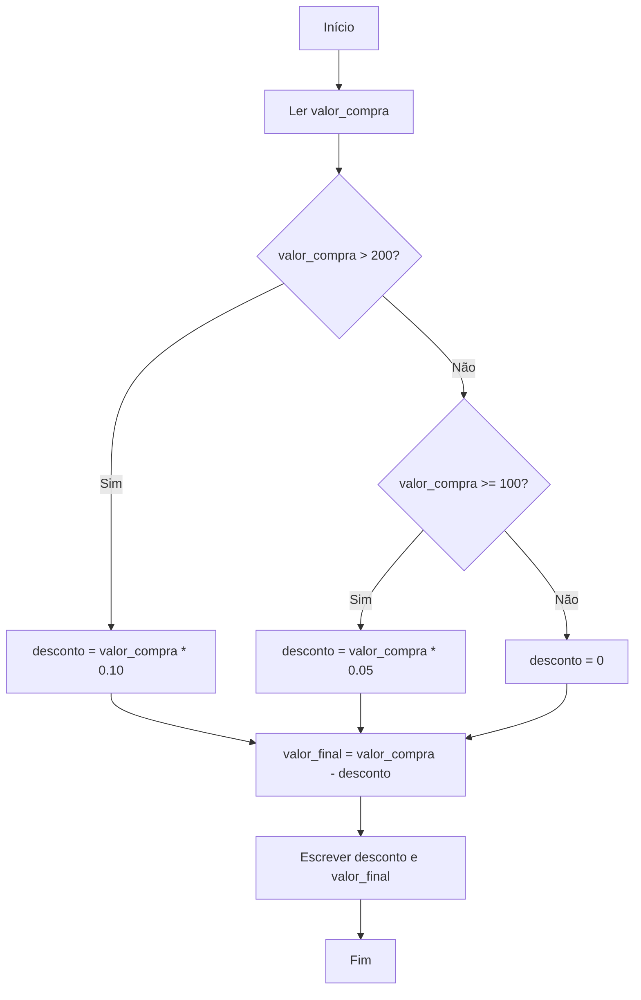

# Propostas de Algoritmos para Tomada de Decisão

A tomada de decisão é um dos pilares da lógica de programação. Ela permite que programas escolham diferentes caminhos de execução com base em condições específicas. Neste tópico, vamos propor e detalhar algoritmos práticos para situações comuns, como a aprovação de alunos e o cálculo de descontos, utilizando pseudocódigo e fluxogramas para facilitar o entendimento.

---

## 1. Algoritmo para Aprovação de Alunos

### **Descrição do Problema**

Em instituições de ensino, é comum utilizar a média das notas dos alunos para decidir se eles foram aprovados ou reprovados em uma disciplina. Suponha que a média mínima para aprovação seja 6,0.

### **Passos do Algoritmo**

1. Ler as notas do aluno.
2. Calcular a média das notas.
3. Verificar se a média é maior ou igual a 6,0.
4. Exibir o resultado: "Aprovado" ou "Reprovado".

### **Pseudocódigo**

```plaintext
Início
    Ler nota1
    Ler nota2
    Ler nota3
    media <- (nota1 + nota2 + nota3) / 3
    Se media >= 6.0 então
        Escrever "Aprovado"
    Senão
        Escrever "Reprovado"
    FimSe
Fim
```

### **Fluxograma**

```mermaid
flowchart TD
    A[Início] --> B[Ler nota1, nota2, nota3]
    B --> C[Calcular média]
    C --> D{Média >= 6.0?}
    D -- Sim --> E[Escrever "Aprovado"]
    D -- Não --> F[Escrever "Reprovado"]
    E --> G[Fim]
    F --> G
```

---

## 2. Algoritmo para Cálculo de Descontos

### **Descrição do Problema**

Em uma loja, clientes podem receber descontos dependendo do valor da compra. Por exemplo:
- Compras acima de R$ 200,00 recebem 10% de desconto.
- Compras entre R$ 100,00 e R$ 200,00 recebem 5% de desconto.
- Compras abaixo de R$ 100,00 não recebem desconto.

### **Passos do Algoritmo**

1. Ler o valor da compra.
2. Verificar a faixa de valor e calcular o desconto correspondente.
3. Calcular o valor final.
4. Exibir o valor do desconto e o valor final.

### **Pseudocódigo**

```plaintext
Início
    Ler valor_compra
    Se valor_compra > 200 então
        desconto <- valor_compra * 0.10
    Senão se valor_compra >= 100 então
        desconto <- valor_compra * 0.05
    Senão
        desconto <- 0
    FimSe
    valor_final <- valor_compra - desconto
    Escrever "Desconto: ", desconto
    Escrever "Valor final: ", valor_final
Fim
```

### **Fluxograma**



---

## 3. Boas Práticas na Tomada de Decisão

- **Clareza:** Use condições simples e bem definidas.
- **Organização:** Estruture o algoritmo de forma lógica e sequencial.
- **Reutilização:** Sempre que possível, crie funções para decisões recorrentes.

---

## 4. Exercícios Propostos

1. **Aprovação com Recuperação:** Modifique o algoritmo de aprovação para incluir uma recuperação caso a média esteja entre 4,0 e 6,0.
2. **Desconto Progressivo:** Implemente um algoritmo que aplique descontos progressivos para diferentes faixas de valor de compra.
3. **Decisão de Empréstimo:** Crie um algoritmo que aprove ou negue um empréstimo com base na renda e no valor solicitado.

---

## 5. Conclusão

A tomada de decisão é fundamental para criar algoritmos que resolvem problemas do mundo real. Com a prática, você será capaz de analisar situações, definir condições e implementar soluções eficientes, formando uma base sólida para avançar em qualquer linguagem de programação.
```
