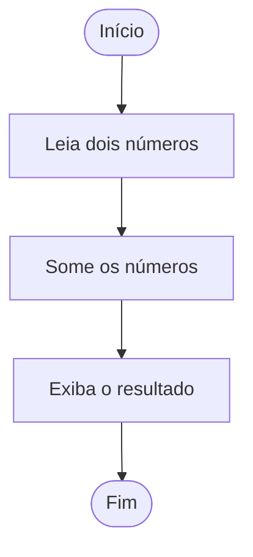

# Regras para Construção de Fluxogramas Claros e Objetivos

Os fluxogramas são ferramentas visuais fundamentais para representar algoritmos de forma clara e compreensível. Eles facilitam a análise, o desenvolvimento e a comunicação de soluções lógicas, tornando o processo de programação mais eficiente, especialmente para iniciantes. No entanto, para que cumpram seu papel, é essencial seguir algumas regras e boas práticas na sua construção. A seguir, apresentamos as principais diretrizes para criar fluxogramas claros, objetivos e eficazes.

---

## 1. **Utilize os Símbolos Padrão**

Os fluxogramas possuem uma simbologia universalmente aceita. Utilizar os símbolos corretos garante que qualquer pessoa com conhecimento básico de lógica de programação consiga interpretar o diagrama. Os principais símbolos são:

- **Elipse/Ovóide**: Indica o início e o fim do algoritmo.
- **Retângulo**: Representa uma ação ou instrução (processo).
- **Paralelogramo**: Usado para entrada e saída de dados.
- **Losango**: Indica uma decisão (condição, teste lógico).
- **Setas**: Mostram o fluxo de execução.

> **Dica:** Evite criar ou modificar símbolos, pois isso pode causar confusão.

---

## 2. **Mantenha o Fluxo de Cima para Baixo ou da Esquerda para a Direita**

O fluxo de execução deve ser sempre claro e seguir uma direção lógica, preferencialmente de cima para baixo. Em casos específicos, pode-se usar o sentido da esquerda para a direita, mas nunca misture as direções no mesmo fluxograma.

---

## 3. **Seja Objetivo e Simples**

Evite excesso de detalhes ou informações desnecessárias. Cada símbolo deve representar uma única ação ou decisão. Se o algoritmo for muito extenso, divida-o em partes menores ou utilize sub-rotinas.

---

## 4. **Nomeie Claramente as Ações e Decisões**

As instruções dentro dos símbolos devem ser curtas, claras e objetivas. Use verbos no imperativo para indicar ações (ex: "Leia valor", "Calcule média"). Em decisões, utilize perguntas diretas (ex: "Valor > 10?").

---

## 5. **Evite Cruzamento de Setas**

O cruzamento de linhas dificulta a leitura e pode gerar interpretações erradas. Planeje o layout do fluxograma para que as setas não se cruzem. Se necessário, reposicione os símbolos.

---

## 6. **Utilize Conectores Quando Necessário**

Em fluxogramas grandes, utilize conectores (círculos com letras ou números) para indicar a continuidade do fluxo em outra parte do diagrama, evitando linhas longas ou cruzamentos.

---

## 7. **Padronize o Tamanho e o Espaçamento dos Símbolos**

Mantenha os símbolos com tamanhos proporcionais e espaçamento uniforme. Isso facilita a leitura e torna o fluxograma mais organizado.

---

## 8. **Revise e Teste o Fluxograma**

Após finalizar, revise o fluxograma para garantir que todas as etapas do algoritmo estão representadas corretamente e que o fluxo está lógico e sem ambiguidades. Se possível, peça para outra pessoa analisar e identificar possíveis melhorias.

---

## 9. **Utilize Ferramentas Adequadas**

Existem diversas ferramentas digitais para criação de fluxogramas (como Lucidchart, Draw.io, Microsoft Visio, entre outras). Elas ajudam a manter o padrão dos símbolos e facilitam ajustes no diagrama.

---

## 10. **Documente e Atualize Sempre que Necessário**

Inclua um título, legenda (se necessário) e data de criação. Mantenha o fluxograma atualizado conforme o algoritmo evolui.

---

## Exemplo de Fluxograma Simples

---

## Conclusão

Seguir essas regras na construção de fluxogramas garante clareza, objetividade e facilita o entendimento do algoritmo por qualquer pessoa. Um fluxograma bem elaborado é um passo fundamental para o sucesso no desenvolvimento de soluções lógicas e na aprendizagem de programação.