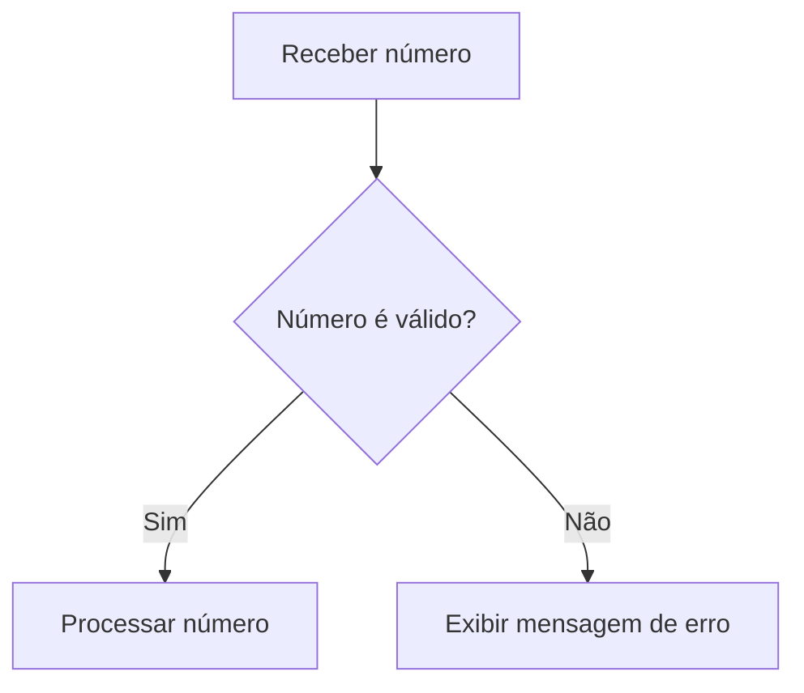
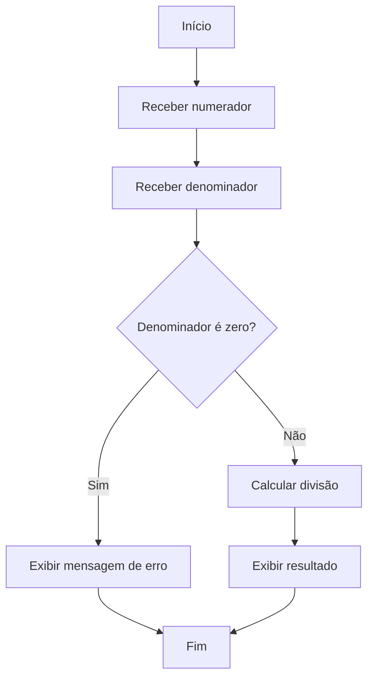

# Boas Práticas para Tratamento de Exceções em Fluxogramas

O tratamento de erros e exceções é uma etapa fundamental no desenvolvimento de algoritmos robustos e confiáveis. Em fluxogramas, que são representações visuais do fluxo lógico de um programa, é essencial prever e ilustrar como o sistema deve reagir a situações inesperadas ou indesejadas. Adotar boas práticas no tratamento de exceções em fluxogramas contribui para a clareza, manutenção e eficiência dos algoritmos, além de preparar o programador para implementar soluções mais seguras em qualquer linguagem de programação.

## O que são Exceções?

Exceções são eventos que interrompem o fluxo normal de execução de um algoritmo devido a condições anormais, como divisões por zero, dados inválidos, arquivos não encontrados, entre outros. O tratamento adequado dessas situações evita falhas inesperadas e melhora a experiência do usuário.

## Por que Representar Exceções em Fluxogramas?

- **Clareza:** Facilita a compreensão do fluxo de tratamento de erros.
- **Prevenção:** Ajuda a identificar possíveis pontos de falha antes da implementação.
- **Documentação:** Serve como referência para desenvolvedores e equipes de manutenção.
- **Padronização:** Garante que todos os casos de exceção sejam tratados de forma consistente.

## Símbolos Utilizados

Em fluxogramas, o tratamento de exceções pode ser representado utilizando os seguintes símbolos:

- **Losango (Decisão):** Para verificar condições de erro.
- **Retângulo (Processo):** Para executar ações corretivas ou mensagens de erro.
- **Retângulo com bordas arredondadas (Início/Fim):** Para indicar a terminação do fluxo em caso de erro crítico.
- **Setas:** Para direcionar o fluxo para rotinas de tratamento de exceções.

## Boas Práticas para Tratamento de Exceções em Fluxogramas

### 1. **Identifique Pontos Críticos**

Antes de desenhar o fluxograma, analise o algoritmo e identifique onde podem ocorrer erros, como:

- Entrada de dados inválidos
- Operações matemáticas perigosas (ex: divisão por zero)
- Acesso a arquivos ou recursos externos
- Comunicação com sistemas externos

### 2. **Inclua Decisões para Verificação de Erros**

Utilize blocos de decisão para verificar se ocorreu algum erro após operações críticas. Por exemplo:

### 3. **Descreva Claramente as Ações de Tratamento**

Ao detectar uma exceção, indique claramente no fluxograma qual ação será tomada, como:

- Exibir mensagem de erro ao usuário
- Solicitar nova entrada de dados
- Encerrar o programa de forma segura
- Registrar o erro para análise posterior

### 4. **Evite Fluxos Complexos e Confusos**

Mantenha o fluxograma simples e organizado. Se o tratamento de exceções for extenso, considere criar subfluxogramas específicos para cada tipo de erro.

### 5. **Padronize a Representação dos Erros**

Utilize símbolos e nomenclaturas padronizadas para facilitar a leitura e manutenção do fluxograma. Por exemplo, sempre usar o mesmo texto para indicar "Erro de entrada de dados".

### 6. **Documente as Exceções Tratadas**

Inclua legendas ou notas explicativas para descrever os tipos de exceções tratadas e as razões para cada decisão tomada.

### 7. **Preveja Caminhos de Recuperação**

Sempre que possível, permita que o usuário ou o sistema tente corrigir o erro, em vez de simplesmente encerrar o fluxo. Por exemplo, solicitar uma nova entrada de dados após um erro.

### 8. **Teste os Fluxos de Exceção**

Após criar o fluxograma, simule os cenários de erro para garantir que todos os caminhos de exceção estão cobertos e levam a uma solução adequada.

## Exemplo Prático

Abaixo, um exemplo simplificado de tratamento de exceção em um fluxograma para divisão de dois números:

Neste exemplo, o fluxograma verifica se o denominador é zero antes de realizar a divisão, tratando a exceção de forma clara e eficiente.

## Conclusão

Representar o tratamento de exceções em fluxogramas é uma prática essencial para o desenvolvimento de algoritmos seguros e confiáveis. Seguindo as boas práticas apresentadas, você garantirá que seu fluxograma seja claro, compreensível e preparado para lidar com situações inesperadas, facilitando a transição para a implementação em qualquer linguagem de programação.