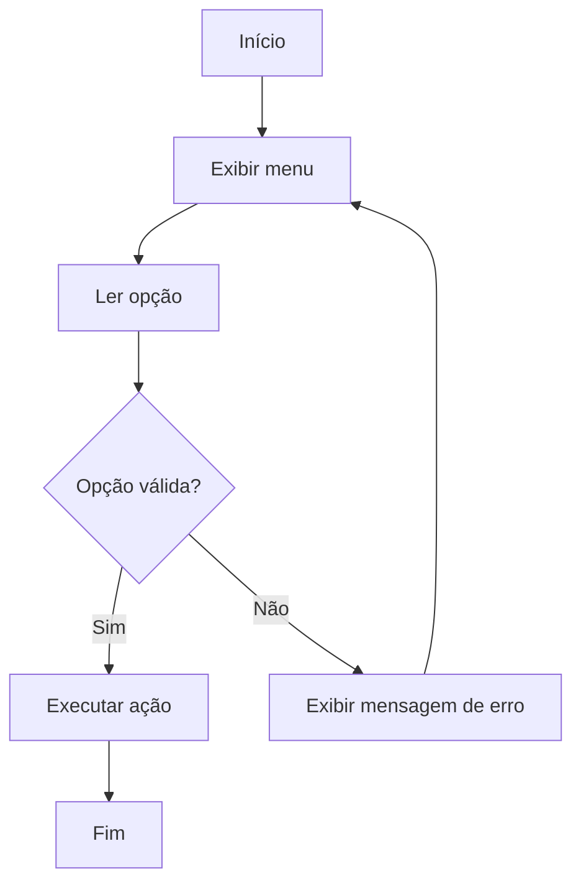

# Exercícios de Validação de Entradas e Tratamento de Exceções

A validação de entradas e o tratamento de exceções são etapas fundamentais no desenvolvimento de algoritmos robustos e confiáveis. Garantir que os dados fornecidos pelo usuário estejam corretos e lidar adequadamente com situações inesperadas são práticas essenciais para evitar erros e falhas durante a execução dos programas.

Neste tópico, você encontrará exercícios práticos para consolidar o entendimento sobre validação de entradas e tratamento de exceções, utilizando pseudocódigo e fluxogramas. Esses exercícios ajudarão a desenvolver o raciocínio lógico necessário para criar programas mais seguros e eficientes.

---

## 1. Exercício: Validação de Número Inteiro Positivo

**Descrição:**  
Solicite ao usuário que digite um número inteiro positivo. Caso o valor informado seja inválido (negativo, zero ou não inteiro), exiba uma mensagem de erro e solicite a entrada novamente até que um valor válido seja fornecido.

**Pseudocódigo:**
```
enquanto verdadeiro faça
    escreva "Digite um número inteiro positivo:"
    leia numero
    se numero é inteiro e numero > 0 então
        pare o loop
    senão
        escreva "Valor inválido! Tente novamente."
fim enquanto
escreva "Número válido informado:", numero
```

**Dica:**  
Utilize estruturas de repetição e decisão para garantir que apenas valores válidos sejam aceitos.

---

## 2. Exercício: Validação de Opção de Menu

**Descrição:**  
Crie um menu simples com três opções (1, 2 e 3). Solicite ao usuário que escolha uma opção. Caso o valor informado não corresponda a uma das opções, exiba uma mensagem de erro e peça a entrada novamente.

**Fluxograma:**



---

## 3. Exercício: Tratamento de Exceções em Divisão

**Descrição:**  
Solicite ao usuário dois números inteiros e realize a divisão do primeiro pelo segundo. Implemente o tratamento para evitar divisão por zero, exibindo uma mensagem de erro caso o segundo número seja zero e solicitando uma nova entrada.

**Pseudocódigo:**
```
leia numerador
enquanto verdadeiro faça
    leia denominador
    se denominador ≠ 0 então
        resultado ← numerador / denominador
        escreva "Resultado:", resultado
        pare o loop
    senão
        escreva "Erro: divisão por zero! Digite outro denominador."
fim enquanto
```

---

## 4. Exercício: Validação de Dados de Cadastro

**Descrição:**  
Solicite ao usuário que informe nome, idade e e-mail. Valide que:
- O nome não esteja vazio.
- A idade seja um número inteiro positivo.
- O e-mail contenha o caractere "@".

Exiba mensagens de erro específicas para cada campo inválido e solicite a entrada novamente até que todos os dados estejam corretos.

---

## 5. Desafio: Calculadora com Tratamento de Erros

**Descrição:**  
Implemente uma calculadora simples que recebe dois números e uma operação (+, -, *, /). Valide as entradas e trate possíveis erros, como operação inválida, divisão por zero e entrada de dados não numéricos.

**Sugestão de abordagem:**
- Use estruturas de repetição para solicitar novamente os dados em caso de erro.
- Exiba mensagens claras para cada tipo de erro identificado.

---

## Dicas para Praticar

- Sempre antecipe possíveis erros de entrada e trate-os de forma amigável.
- Utilize mensagens claras para orientar o usuário sobre o que deve ser corrigido.
- Lembre-se de que a validação de dados é uma das principais formas de garantir a segurança e a confiabilidade dos programas.

---

## Conclusão

A prática constante com exercícios de validação de entradas e tratamento de exceções é fundamental para o desenvolvimento de algoritmos robustos. Ao dominar essas técnicas, você estará mais preparado para criar programas que funcionam corretamente mesmo diante de situações inesperadas, tornando-se um programador mais completo e confiante.

Continue praticando e explore diferentes cenários de validação e tratamento de erros. Isso fará toda a diferença na sua jornada de aprendizado em programação!
```
