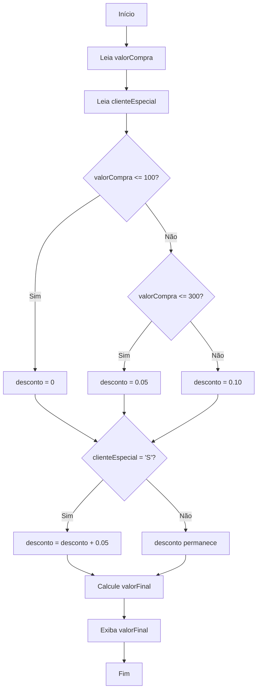

# Exemplo de Aninhamento de Estruturas de Decisão: Descontos Progressivos

No desenvolvimento de algoritmos, é comum nos depararmos com situações em que precisamos tomar decisões baseadas em múltiplas condições. O **aninhamento de estruturas de decisão** ocorre quando utilizamos uma estrutura de decisão dentro de outra, permitindo criar lógicas mais complexas e detalhadas.

Um exemplo prático e bastante utilizado no comércio é o cálculo de **descontos progressivos**. Imagine uma loja que oferece descontos diferentes conforme o valor total da compra, e, além disso, concede um desconto extra para clientes especiais. Vamos ver como implementar essa lógica utilizando estruturas de decisão aninhadas.

## Cenário

- Compras até R$ 100,00: **sem desconto**
- Compras entre R$ 100,01 e R$ 300,00: **5% de desconto**
- Compras acima de R$ 300,00: **10% de desconto**
- Se o cliente for especial, recebe **mais 5% de desconto** sobre o valor já descontado.

## Pseudocódigo

```pseudocode
INICIO
    LEIA valorCompra
    LEIA clienteEspecial (S/N)
    
    SE valorCompra <= 100 ENTAO
        desconto = 0
    SENAO
        SE valorCompra <= 300 ENTAO
            desconto = 0.05
        SENAO
            desconto = 0.10
        FIM_SE
    FIM_SE

    SE clienteEspecial = 'S' ENTAO
        desconto = desconto + 0.05
    FIM_SE

    valorFinal = valorCompra - (valorCompra * desconto)
    ESCREVA "Valor final da compra: R$", valorFinal
FIM
```

## Explicação do Aninhamento

Observe que a primeira estrutura de decisão (`SE valorCompra <= 100`) contém outra estrutura (`SE valorCompra <= 300`) dentro do bloco `SENAO`. Isso é o **aninhamento**: uma decisão dentro de outra, permitindo tratar faixas de valores diferentes.

Após determinar o desconto inicial, uma nova decisão é tomada: se o cliente é especial, um desconto adicional é aplicado. Assim, as decisões são avaliadas em sequência, de acordo com as regras do negócio.

## Exemplo em Fluxograma



## Exemplo em Python

```python
valor_compra = float(input("Digite o valor da compra: "))
cliente_especial = input("Cliente especial? (S/N): ").upper()

if valor_compra <= 100:
    desconto = 0
elif valor_compra <= 300:
    desconto = 0.05
else:
    desconto = 0.10

if cliente_especial == 'S':
    desconto += 0.05

valor_final = valor_compra - (valor_compra * desconto)
print(f"Valor final da compra: R$ {valor_final:.2f}")
```

## Considerações Finais

O aninhamento de estruturas de decisão é uma ferramenta poderosa para criar algoritmos que precisam lidar com múltiplas condições. No exemplo apresentado, conseguimos aplicar regras de descontos progressivos de forma clara e organizada, facilitando a manutenção e a compreensão do código.

Ao praticar o aninhamento, lembre-se de manter o código legível e bem estruturado, evitando níveis excessivos de profundidade, o que pode dificultar a leitura e a manutenção do programa.
```
