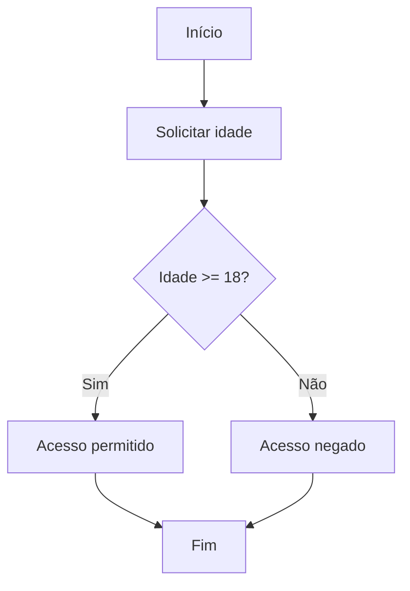

# Exemplo de Validação de Entrada de Dados com if/else

A validação de entrada de dados é uma etapa fundamental no desenvolvimento de qualquer programa. Ela garante que as informações fornecidas pelo usuário estejam corretas e dentro dos parâmetros esperados, evitando erros e comportamentos indesejados durante a execução do software.

Uma das formas mais comuns de realizar essa validação é utilizando as estruturas de decisão `if` e `else`. Essas estruturas permitem que o programa tome decisões com base em condições, executando diferentes blocos de código conforme o valor das variáveis de entrada.

## Exemplo Prático: Validação de Idade

Vamos supor que estamos desenvolvendo um sistema que solicita ao usuário a sua idade e, com base nessa informação, determina se ele pode acessar determinado conteúdo (por exemplo, um site restrito para maiores de 18 anos).

### Pseudocódigo

```pseudocode
Início
    Escreva "Digite sua idade:"
    Leia idade

    Se idade >= 18 então
        Escreva "Acesso permitido."
    Senão
        Escreva "Acesso negado. Você deve ter 18 anos ou mais."
Fim
```

### Explicação

- O programa solicita que o usuário digite sua idade.
- Utiliza a estrutura `if` para verificar se a idade informada é maior ou igual a 18.
- Se a condição for verdadeira, exibe a mensagem de acesso permitido.
- Caso contrário (`else`), exibe uma mensagem informando que o acesso está negado.

### Exemplo em Python

```python
idade = int(input("Digite sua idade: "))

if idade >= 18:
    print("Acesso permitido.")
else:
    print("Acesso negado. Você deve ter 18 anos ou mais.")
```

### Exemplo em Fluxograma



## Boas Práticas na Validação

- **Verifique o tipo de dado:** Certifique-se de que o usuário está inserindo um número e não um texto ou caractere inválido.
- **Forneça mensagens claras:** Informe ao usuário exatamente o que está errado e como corrigir.
- **Repita a solicitação se necessário:** Em casos reais, é comum pedir novamente a entrada até que um valor válido seja fornecido.

### Exemplo de Validação Reforçada

```python
while True:
    entrada = input("Digite sua idade: ")
    if entrada.isdigit():
        idade = int(entrada)
        if idade >= 18:
            print("Acesso permitido.")
        else:
            print("Acesso negado. Você deve ter 18 anos ou mais.")
        break
    else:
        print("Por favor, digite um número válido.")
```

## Conclusão

A utilização das estruturas `if` e `else` para validação de entrada de dados é essencial para garantir a robustez e a confiabilidade dos programas. Com exemplos práticos e boas práticas, é possível criar sistemas mais seguros e fáceis de usar, proporcionando uma melhor experiência ao usuário e evitando erros comuns durante a execução.
```
