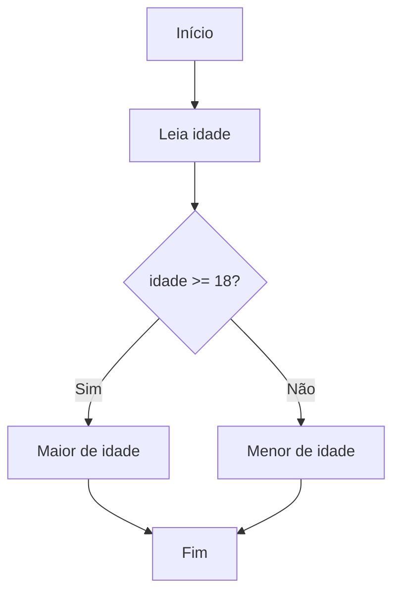
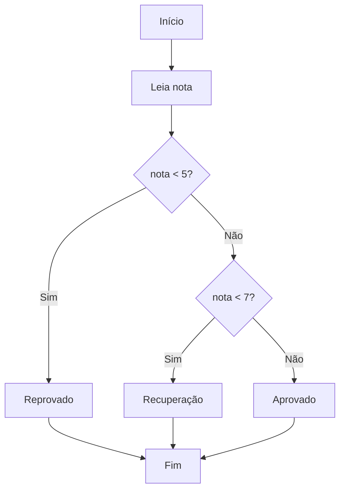
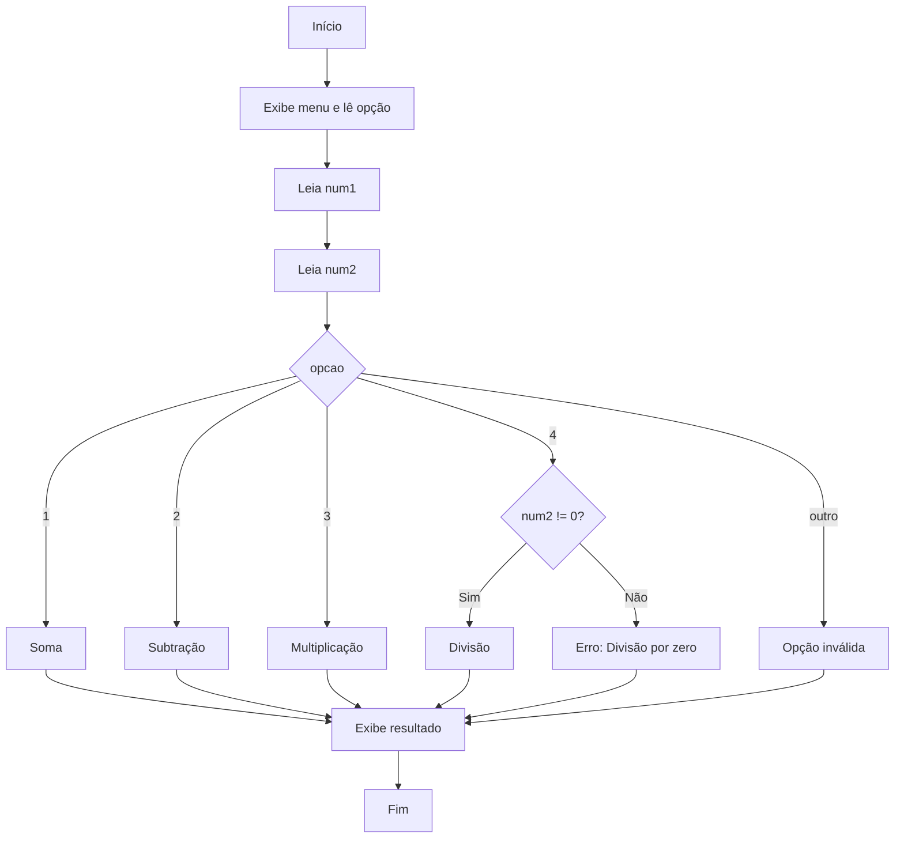

# Propostas de Algoritmos para Diferentes Cenários de Decisão

As **estruturas de decisão** são fundamentais na lógica de programação, pois permitem que um algoritmo tome diferentes caminhos de execução conforme determinadas condições. Os comandos `if`, `else` e `switch` são amplamente utilizados para implementar essas decisões. A seguir, apresentamos propostas de algoritmos para diferentes cenários de decisão, utilizando pseudocódigo e fluxogramas, para fixação dos conceitos.

---

## 1. Verificação de Maioridade

**Cenário:** Dado a idade de uma pessoa, determinar se ela é maior de idade (18 anos ou mais).

### Pseudocódigo

```
Leia idade
Se idade >= 18 então
    Escreva "Maior de idade"
Senão
    Escreva "Menor de idade"
FimSe
```

### Fluxograma



---

## 2. Classificação de Notas

**Cenário:** Receber a nota de um aluno e classificar como "Reprovado" (nota < 5), "Recuperação" (nota >= 5 e < 7) ou "Aprovado" (nota >= 7).

### Pseudocódigo

```
Leia nota
Se nota < 5 então
    Escreva "Reprovado"
Senão se nota < 7 então
    Escreva "Recuperação"
Senão
    Escreva "Aprovado"
FimSe
```

### Fluxograma



---

## 3. Menu de Opções com Switch

**Cenário:** Apresentar um menu para o usuário escolher uma operação matemática: 1 - Soma, 2 - Subtração, 3 - Multiplicação, 4 - Divisão.

### Pseudocódigo

```
Escreva "Escolha uma operação: 1-Soma, 2-Subtração, 3-Multiplicação, 4-Divisão"
Leia opcao
Leia num1
Leia num2

Switch opcao
    Caso 1:
        resultado = num1 + num2
        Escreva "Resultado: ", resultado
    Caso 2:
        resultado = num1 - num2
        Escreva "Resultado: ", resultado
    Caso 3:
        resultado = num1 * num2
        Escreva "Resultado: ", resultado
    Caso 4:
        Se num2 != 0 então
            resultado = num1 / num2
            Escreva "Resultado: ", resultado
        Senão
            Escreva "Divisão por zero não permitida"
        FimSe
    Padrão:
        Escreva "Opção inválida"
FimSwitch
```

### Fluxograma



---

## 4. Desconto Progressivo em Compras

**Cenário:** Calcular o valor final de uma compra com desconto progressivo:
- Até R$ 100,00: sem desconto
- De R$ 100,01 a R$ 200,00: 5% de desconto
- Acima de R$ 200,00: 10% de desconto

### Pseudocódigo

```
Leia valor_compra
Se valor_compra <= 100 então
    desconto = 0
Senão se valor_compra <= 200 então
    desconto = valor_compra * 0.05
Senão
    desconto = valor_compra * 0.10
FimSe
valor_final = valor_compra - desconto
Escreva "Valor final: ", valor_final
```

---

## 5. Identificação de Números Pares e Ímpares

**Cenário:** Dado um número, identificar se ele é par ou ímpar.

### Pseudocódigo

```
Leia numero
Se numero % 2 == 0 então
    Escreva "Par"
Senão
    Escreva "Ímpar"
FimSe
```

---

## Considerações Finais

Esses exemplos ilustram como as estruturas de decisão são aplicadas em diferentes situações do cotidiano da programação. Praticar a criação de algoritmos para cenários variados é essencial para desenvolver o raciocínio lógico e a capacidade de resolver problemas de forma eficiente. Ao dominar essas estruturas, você estará preparado para enfrentar desafios mais complexos em qualquer linguagem de programação.
```
