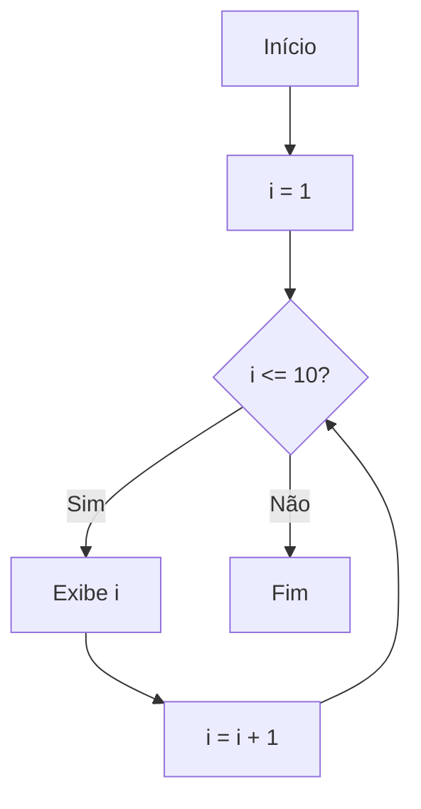

## Exemplo Prático de Contagem Crescente com `for`

A estrutura de repetição `for` é amplamente utilizada na programação para executar um bloco de código um número determinado de vezes. Ela é especialmente útil quando sabemos exatamente quantas vezes queremos que o laço seja repetido, como em situações de contagem crescente ou decrescente.

### Sintaxe Básica do `for`

A sintaxe geral do `for` em pseudocódigo é:

```
para (inicialização; condição; incremento) faça
    // bloco de comandos
fim_para
```

- **Inicialização:** Define o valor inicial da variável de controle.
- **Condição:** Enquanto for verdadeira, o bloco de comandos será executado.
- **Incremento:** Atualiza a variável de controle a cada iteração.

### Exemplo Prático: Contagem Crescente de 1 a 10

Vamos criar um exemplo simples onde queremos exibir na tela os números de 1 a 10, um por linha. Para isso, utilizamos o `for` para controlar a contagem crescente.

#### Pseudocódigo

```pseudocode
para i de 1 até 10 passo 1 faça
    escreva(i)
fim_para
```

**Explicação:**
- A variável `i` começa em 1.
- A cada repetição, `i` é incrementada em 1 (`passo 1`).
- O laço continua enquanto `i` for menor ou igual a 10.
- Em cada iteração, o valor atual de `i` é exibido.

#### Fluxograma



#### Exemplo em Linguagem de Programação (Python)

```python
for i in range(1, 11):
    print(i)
```
- `range(1, 11)` gera os números de 1 até 10 (o 11 não é incluído).
- O comando `print(i)` exibe cada número na tela.

#### Exemplo em Linguagem de Programação (JavaScript)

```javascript
for (let i = 1; i <= 10; i++) {
    console.log(i);
}
```
- `let i = 1` inicializa a variável.
- `i <= 10` é a condição de parada.
- `i++` incrementa `i` em 1 a cada iteração.

### Aplicações Práticas

A contagem crescente com `for` é útil em diversas situações, como:
- Exibir listas numeradas.
- Processar elementos de um vetor ou matriz.
- Repetir tarefas um número fixo de vezes.

### Dicas e Boas Práticas

- Sempre escolha nomes de variáveis significativos quando possível.
- Certifique-se de que a condição de parada será atingida para evitar laços infinitos.
- Utilize o `for` quando souber exatamente o número de repetições necessárias.

---

**Resumo:**  
O laço `for` é uma ferramenta poderosa para realizar contagens crescentes de forma simples e eficiente. Compreender sua sintaxe e funcionamento é fundamental para a criação de algoritmos claros e organizados, servindo de base para problemas mais complexos na programação.
```
