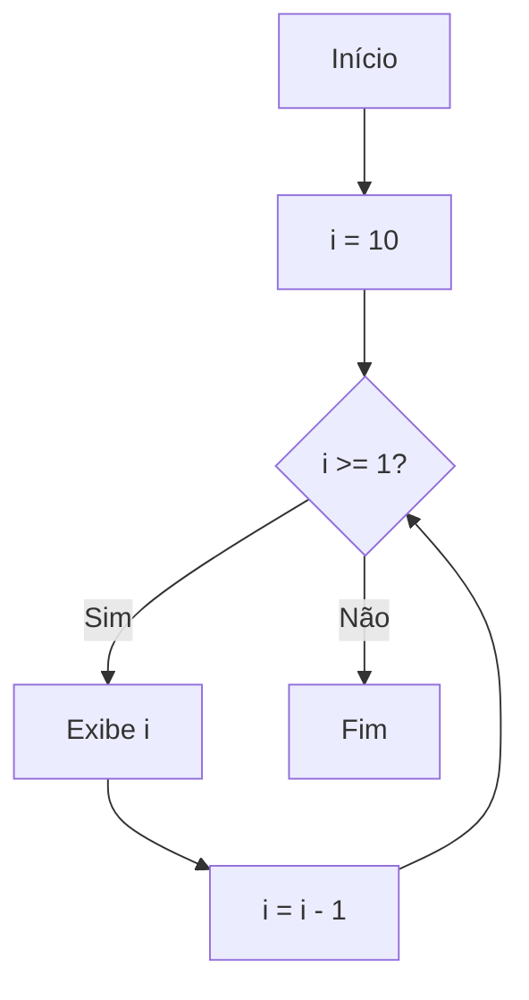

## Exemplo Prático de Contagem Decrescente com `for`

A estrutura de repetição `for` é amplamente utilizada quando sabemos exatamente quantas vezes um bloco de código deve ser executado. Um dos exemplos clássicos de uso do `for` é a realização de uma contagem decrescente, ou seja, iniciar de um valor e diminuir até atingir um limite estabelecido.

### Sintaxe Geral do `for`

A sintaxe básica do `for` em pseudocódigo é:

```
para (inicialização; condição; atualização) faça
    // bloco de comandos
fim_para
```

- **Inicialização:** Define o valor inicial da variável de controle.
- **Condição:** Enquanto for verdadeira, o bloco de comandos será executado.
- **Atualização:** Modifica a variável de controle a cada iteração.

### Exemplo Prático: Contagem Decrescente

Vamos supor que queremos exibir na tela uma contagem regressiva de 10 até 1. Utilizaremos o `for` para controlar essa contagem.

#### Pseudocódigo

```pseudocode
para (i = 10; i >= 1; i = i - 1) faça
    escreva(i)
fim_para
```

**Explicação:**
- A variável `i` é inicializada com o valor 10.
- A condição `i >= 1` garante que o laço continue enquanto `i` for maior ou igual a 1.
- A cada iteração, `i` é decrementado em 1 (`i = i - 1`).
- O comando `escreva(i)` exibe o valor atual de `i`.

#### Fluxograma



#### Exemplo em Linguagem de Programação (Python)

```python
for i in range(10, 0, -1):
    print(i)
```
- `range(10, 0, -1)` gera uma sequência de 10 até 1, decrementando de 1 em 1.

#### Exemplo em Linguagem de Programação (JavaScript)

```javascript
for (let i = 10; i >= 1; i--) {
    console.log(i);
}
```

### Aplicações Práticas

A contagem decrescente é útil em diversas situações, como:
- Temporizadores (timers) e cronômetros regressivos.
- Exibição de mensagens de "contagem regressiva" para eventos.
- Controle de tentativas em sistemas de login.

### Conclusão

O uso do `for` para contagem decrescente é simples e eficiente. Compreender essa estrutura é fundamental para resolver problemas que envolvem repetições controladas, tornando o desenvolvimento de algoritmos mais prático e organizado.
```
