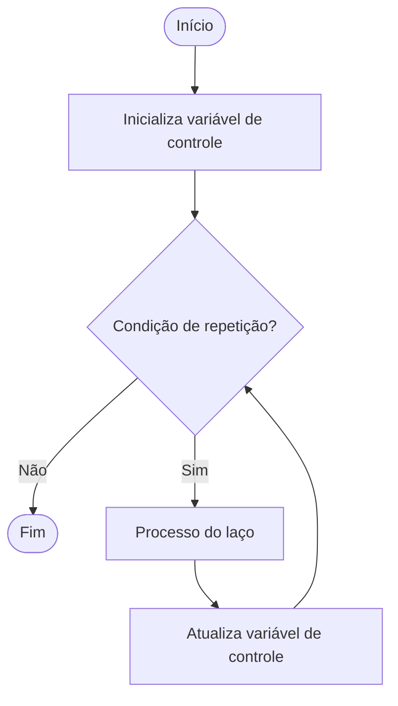

# Erros Comuns ao Desenhar Fluxogramas de Laços

Os fluxogramas são ferramentas visuais fundamentais para representar algoritmos e compreender o fluxo de execução de programas, especialmente ao trabalhar com **estruturas de repetição** (laços), como `for`, `while` e `do-while`. No entanto, iniciantes frequentemente cometem erros ao desenhar fluxogramas desses laços, o que pode dificultar a compreensão e a implementação correta dos algoritmos. A seguir, destacamos os principais erros e como evitá-los.

---

## 1. **Omissão da Condição de Parada**

Um dos erros mais comuns é **não representar claramente a condição de parada** do laço. Todo laço precisa de uma condição que determine quando a repetição deve ser encerrada. Se essa condição não estiver explícita no fluxograma, o algoritmo pode parecer executar indefinidamente.

**Como evitar:**  
Sempre inclua um losango (decisão) com a condição de parada do laço. Indique claramente os caminhos "Sim" (continua o laço) e "Não" (sai do laço).

---

## 2. **Falta de Atualização da Variável de Controle**

Em laços controlados por variáveis (como o `for` ou `while`), é comum esquecer de **atualizar a variável de controle** dentro do laço. Isso pode levar a laços infinitos ou a execução incorreta do algoritmo.

**Como evitar:**  
Inclua no fluxograma um retângulo (processo) para atualizar a variável de controle (incremento, decremento ou outra modificação), antes de retornar à condição de repetição.

---

## 3. **Fluxo de Retorno Incorreto**

Outro erro frequente é **desenhar o fluxo de retorno do laço de forma errada**, conectando-o ao ponto errado do fluxograma. Isso pode causar confusão sobre onde o laço recomeça e onde termina.

**Como evitar:**  
O fluxo de retorno do laço deve sempre voltar para a verificação da condição de repetição, nunca para o início do algoritmo ou para fora do laço.

---

## 4. **Mistura de Processos Internos e Externos ao Laço**

Às vezes, processos que deveriam ocorrer **fora do laço** são colocados dentro dele, ou vice-versa. Isso altera a lógica do algoritmo e pode gerar resultados inesperados.

**Como evitar:**  
Analise cuidadosamente quais etapas pertencem ao corpo do laço e quais devem ser executadas apenas uma vez, antes ou depois da repetição. No fluxograma, posicione corretamente cada processo.

---

## 5. **Ausência de Indicação de Início e Fim**

Todo fluxograma deve ter símbolos claros de **início** e **fim**. Esquecer de incluir esses elementos pode dificultar a leitura e a compreensão do fluxo geral do algoritmo.

**Como evitar:**  
Utilize sempre os símbolos de terminal (elipse ou retângulo com cantos arredondados) para marcar o início e o fim do fluxograma.

---

## 6. **Laços Infinitos Não Intencionais**

Ao omitir a condição de parada ou a atualização da variável de controle, pode-se criar **laços infinitos não intencionais**. Isso é um erro lógico grave, pois o algoritmo nunca termina.

**Como evitar:**  
Revise o fluxograma para garantir que, em algum momento, a condição de parada será satisfeita e o laço será encerrado.

---

## 7. **Falta de Clareza nos Caminhos de Decisão**

Em alguns fluxogramas, os caminhos "Sim" e "Não" da decisão não estão claramente indicados, o que pode causar confusão sobre o fluxo do laço.

**Como evitar:**  
Rotule sempre as setas que saem do losango de decisão com "Sim" e "Não" (ou "Verdadeiro" e "Falso"), indicando claramente o que acontece em cada caso.

---

## Exemplo de Fluxograma Correto de um Laço `while`



---

## Conclusão

Desenhar fluxogramas de laços exige atenção aos detalhes e compreensão clara da lógica de repetição. Evitar os erros comuns listados acima é fundamental para criar fluxogramas precisos, que realmente auxiliem na análise e implementação de algoritmos. Sempre revise seu fluxograma, certificando-se de que todos os elementos essenciais estão presentes e corretamente posicionados.

---
```