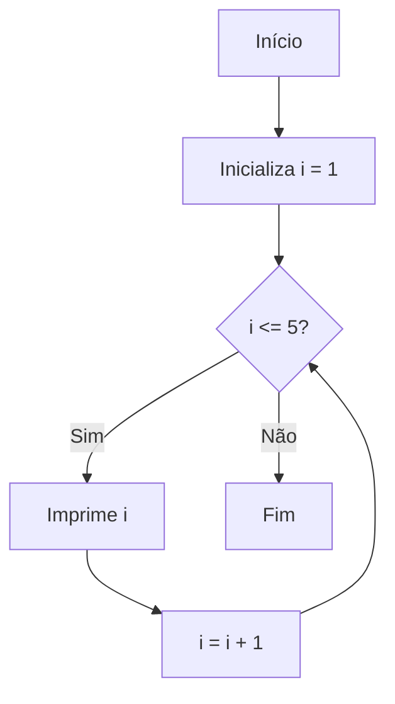
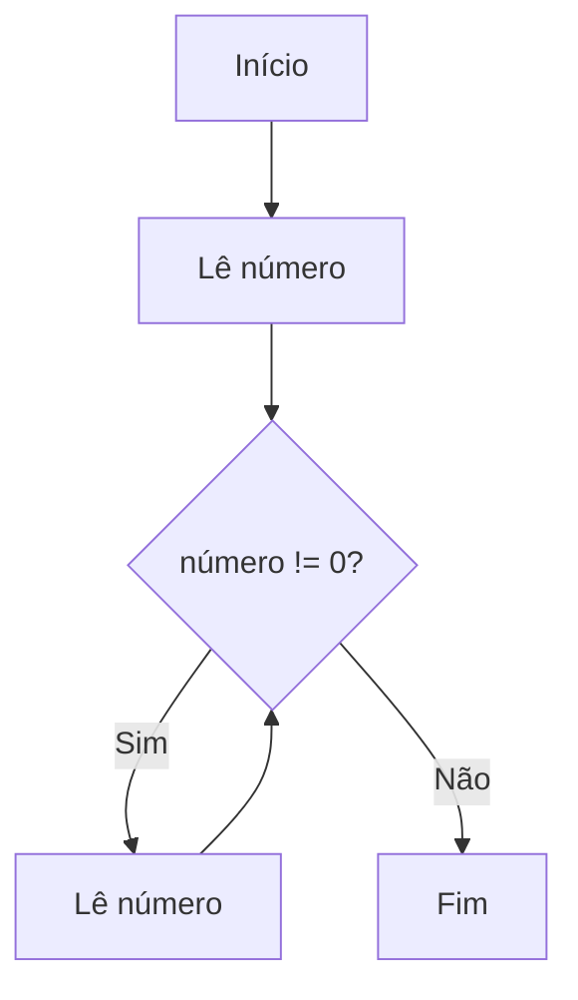
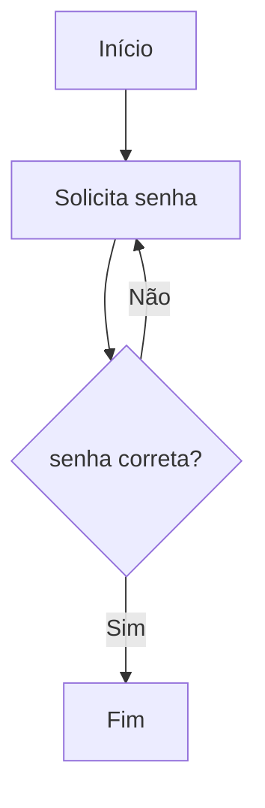

# Exemplos de Fluxogramas com Diferentes Estruturas de Repetição

As estruturas de repetição são fundamentais na lógica de programação, pois permitem executar um conjunto de instruções várias vezes, de acordo com uma condição. Os principais tipos são: **for**, **while** e **do-while**. Para facilitar o entendimento do funcionamento dessas estruturas, o uso de **fluxogramas** é uma excelente prática, pois eles representam visualmente o fluxo de execução de um algoritmo.

A seguir, apresentamos exemplos de fluxogramas para cada uma dessas estruturas de repetição, destacando suas características e diferenças.

---

## 1. Fluxograma da Estrutura **for**

A estrutura **for** é utilizada quando se sabe previamente o número de repetições que será realizado. Ela é composta por três partes: inicialização, condição e incremento.

**Exemplo:** Imprimir os números de 1 a 5.

**Fluxograma:**



**Descrição do Fluxo:**
- Inicializa a variável `i` com 1.
- Verifica se `i` é menor ou igual a 5.
- Se sim, imprime o valor de `i` e incrementa `i` em 1.
- Repete o processo até que a condição seja falsa.

---

## 2. Fluxograma da Estrutura **while**

A estrutura **while** é utilizada quando não se sabe exatamente quantas vezes o bloco de código será executado, mas a repetição depende de uma condição ser verdadeira.

**Exemplo:** Ler números do usuário até que ele digite 0.

**Fluxograma:**



**Descrição do Fluxo:**
- Lê um número do usuário.
- Enquanto o número for diferente de 0, continua lendo novos números.
- Quando o usuário digita 0, o loop termina.

---

## 3. Fluxograma da Estrutura **do-while**

A estrutura **do-while** é semelhante ao **while**, mas garante que o bloco de código será executado pelo menos uma vez, pois a condição é verificada **após** a execução do bloco.

**Exemplo:** Solicitar uma senha até que o usuário digite a senha correta.

**Fluxograma:**



**Descrição do Fluxo:**
- Solicita a senha ao usuário.
- Verifica se a senha está correta.
- Se não estiver, solicita novamente.
- Repete até que a senha correta seja informada.

---

## Comparando as Estruturas

| Estrutura | Verificação da Condição | Execução Mínima |
|-----------|------------------------|-----------------|
| for       | Antes do bloco         | Pode ser zero   |
| while     | Antes do bloco         | Pode ser zero   |
| do-while  | Depois do bloco        | Pelo menos uma  |

---

## Conclusão

Os fluxogramas são ferramentas visuais poderosas para compreender o funcionamento das estruturas de repetição. Eles ajudam a planejar algoritmos, identificar possíveis erros e facilitam a comunicação de ideias. Com a prática, a leitura e criação de fluxogramas tornam-se habilidades essenciais para qualquer programador iniciante.

---
```
**Observação:** Os fluxogramas acima utilizam a sintaxe [Mermaid](https://mermaid-js.github.io/mermaid/#/) para facilitar a visualização em ambientes compatíveis. Caso não visualize corretamente, utilize ferramentas online ou desenhe os fluxogramas em papel para melhor compreensão.
