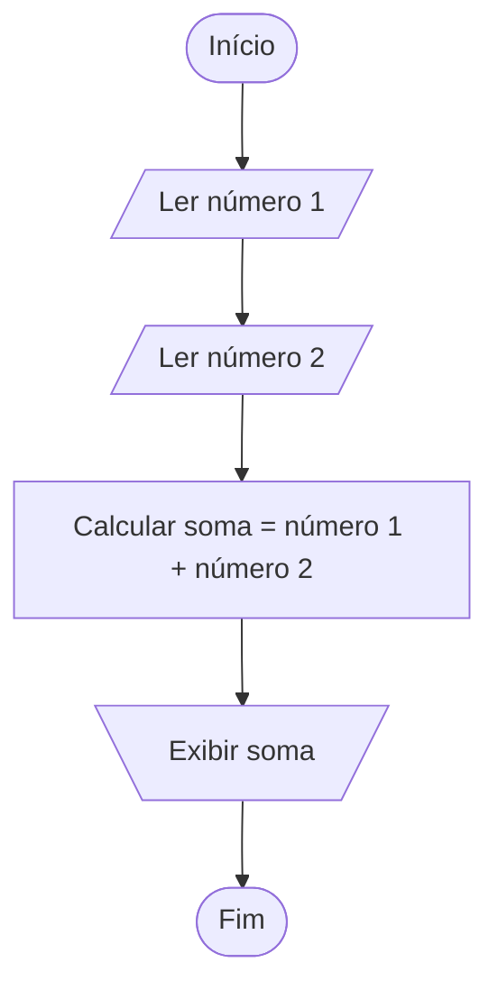
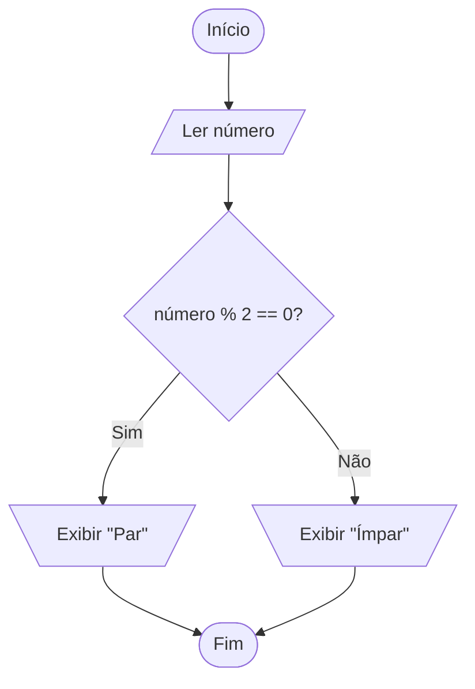
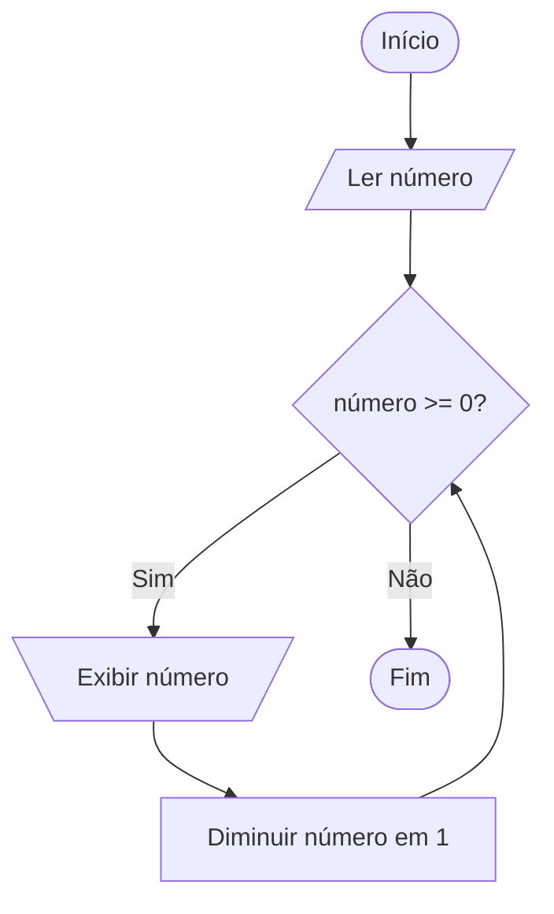

# Exercícios de Tradução de Algoritmos para Fluxogramas

A tradução de algoritmos para fluxogramas é uma etapa fundamental no processo de aprendizagem da lógica de programação. Os fluxogramas são representações gráficas que facilitam a visualização do fluxo de execução de um algoritmo, tornando mais simples a identificação de etapas, decisões e repetições. Neste tópico, você encontrará exercícios práticos que ajudarão a consolidar o entendimento sobre como transformar descrições algorítmicas em fluxogramas claros e funcionais.

## Por que traduzir algoritmos para fluxogramas?

Antes de iniciar os exercícios, é importante compreender os benefícios dessa prática:

- **Visualização do fluxo lógico:** O fluxograma permite enxergar o caminho que o algoritmo percorre, facilitando a identificação de erros e melhorias.
- **Facilidade de comunicação:** Fluxogramas são universais e podem ser compreendidos por pessoas com diferentes níveis de conhecimento técnico.
- **Base para implementação:** Um fluxograma bem elaborado serve como guia para a codificação em qualquer linguagem de programação.

## Elementos básicos de um fluxograma

Antes de começar os exercícios, revise os principais símbolos utilizados:

- **Elipse:** Indica início e fim do algoritmo.
- **Retângulo:** Representa uma ação ou processamento.
- **Losango:** Indica uma decisão (condicional).
- **Setas:** Mostram o fluxo de execução.
- **Paralelogramo:** Entrada ou saída de dados.

## Exercício 1: Algoritmo de Soma Simples

**Descrição do algoritmo:**

1. Ler dois números inteiros.
2. Calcular a soma dos dois números.
3. Exibir o resultado.

**Passos para tradução:**

- Identifique as entradas (leitura dos números).
- Represente o processamento (soma).
- Indique a saída (exibição do resultado).

**Fluxograma:**



---

## Exercício 2: Algoritmo de Verificação de Número Par ou Ímpar

**Descrição do algoritmo:**

1. Ler um número inteiro.
2. Verificar se o número é par ou ímpar.
3. Exibir a mensagem correspondente.

**Passos para tradução:**

- Entrada do número.
- Decisão: o número dividido por 2 tem resto zero?
- Saída: exibir "Par" ou "Ímpar".

**Fluxograma:**



---

## Exercício 3: Algoritmo de Contagem Regressiva

**Descrição do algoritmo:**

1. Ler um número inteiro positivo.
2. Exibir a contagem regressiva até zero.

**Passos para tradução:**

- Entrada do número.
- Estrutura de repetição: enquanto o número for maior ou igual a zero, exibir o número e diminuir 1.

**Fluxograma:**



---

## Dicas para a tradução de algoritmos para fluxogramas

- **Leia atentamente o algoritmo:** Entenda cada etapa antes de desenhar.
- **Identifique entradas, saídas, decisões e repetições.**
- **Utilize os símbolos corretos:** Isso facilita a leitura e compreensão.
- **Siga o fluxo de cima para baixo ou da esquerda para a direita.**
- **Revise o fluxograma:** Certifique-se de que todas as etapas do algoritmo estão representadas.

## Exercícios Propostos

1. **Algoritmo de cálculo da média de três notas:** Ler três notas, calcular a média e exibir se o aluno foi aprovado (média ≥ 7) ou reprovado.
2. **Algoritmo de fatorial:** Ler um número inteiro positivo e calcular seu fatorial utilizando repetição.
3. **Algoritmo de maior número:** Ler dois números e exibir qual é o maior.

Tente traduzir esses algoritmos para fluxogramas, aplicando os conceitos apresentados. Praticar a tradução de algoritmos para fluxogramas é essencial para desenvolver o raciocínio lógico e preparar-se para a implementação em qualquer linguagem de programação.

---

**Conclusão:**  
A tradução de algoritmos para fluxogramas é uma habilidade essencial para quem está começando na programação. Ela facilita a compreensão dos processos lógicos e serve como base para a escrita de códigos eficientes e organizados. Pratique bastante e utilize fluxogramas sempre que precisar planejar ou explicar um algoritmo!
```
