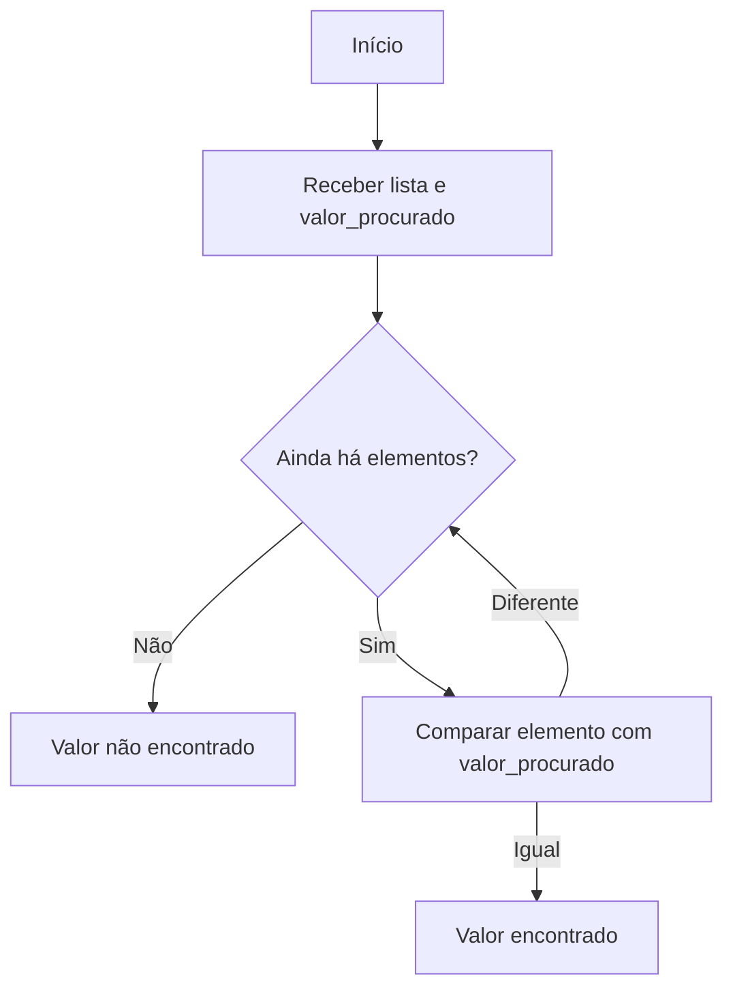

# Exercícios de Busca de Valores em Listas com Laços de Repetição

A busca de valores em listas é uma das tarefas mais comuns na programação. Utilizando laços de repetição, é possível percorrer todos os elementos de uma lista para encontrar um valor específico, contar ocorrências ou identificar a posição de determinado item. Este tipo de exercício é fundamental para fixar o entendimento sobre estruturas de repetição e manipulação de coleções de dados.

## Conceitos Fundamentais

Antes de iniciar os exercícios, é importante compreender alguns conceitos:

- **Lista**: Estrutura de dados que armazena uma sequência de elementos, podendo ser números, textos, etc.
- **Laço de repetição**: Estrutura que permite executar um bloco de código várias vezes, como `for`, `while` e `do-while`.
- **Busca**: Processo de examinar cada elemento da lista para encontrar um valor ou condição desejada.

## Exemplos Práticos

### 1. Busca Simples de um Valor

**Problema:**  
Dada uma lista de números, verifique se um determinado valor está presente na lista.

**Pseudocódigo:**
```
receba lista de números
receba valor_procurado
para cada elemento em lista
    se elemento == valor_procurado
        escreva "Valor encontrado"
        pare o laço
se laço terminou sem encontrar
    escreva "Valor não encontrado"
```

**Fluxograma:**



### 2. Contar Ocorrências de um Valor

**Problema:**  
Conte quantas vezes um valor aparece em uma lista.

**Pseudocódigo:**
```
receba lista de números
receba valor_procurado
contador = 0
para cada elemento em lista
    se elemento == valor_procurado
        contador = contador + 1
escreva "O valor aparece", contador, "vezes"
```

### 3. Encontrar a Posição de um Valor

**Problema:**  
Encontre a posição (índice) do primeiro valor igual ao procurado em uma lista.

**Pseudocódigo:**
```
receba lista de números
receba valor_procurado
para i de 0 até tamanho da lista - 1
    se lista[i] == valor_procurado
        escreva "Valor encontrado na posição", i
        pare o laço
se laço terminou sem encontrar
    escreva "Valor não encontrado"
```

## Exercícios Propostos

1. **Busca Simples:**  
   Peça ao usuário para digitar 10 números e, em seguida, um número a ser buscado. Informe se o número está ou não na lista.

2. **Contagem de Ocorrências:**  
   Dada uma lista de nomes, conte quantas vezes um nome específico aparece.

3. **Busca de Múltiplos Valores:**  
   Dada uma lista de números, encontre todos os índices onde um valor aparece.

4. **Busca do Maior Valor:**  
   Percorra uma lista de números e encontre o maior valor presente.

5. **Busca do Menor Valor:**  
   Percorra uma lista de números e encontre o menor valor presente.

## Dicas e Boas Práticas

- Sempre inicialize variáveis de controle, como contadores e índices.
- Utilize laços adequados ao problema: `for` para percorrer listas com tamanho conhecido, `while` para condições dinâmicas.
- Lembre-se de tratar casos em que o valor não é encontrado.
- Comente seu código para facilitar o entendimento.

## Conclusão

Exercícios de busca em listas com laços de repetição são essenciais para consolidar o raciocínio lógico e a manipulação de estruturas de dados. Praticar esses exercícios prepara o iniciante para desafios mais complexos e para o uso eficiente de listas em qualquer linguagem de programação.

---
**Pratique!** Tente resolver os exercícios propostos utilizando pseudocódigo, fluxogramas ou até mesmo em uma linguagem de programação de sua escolha.
```
