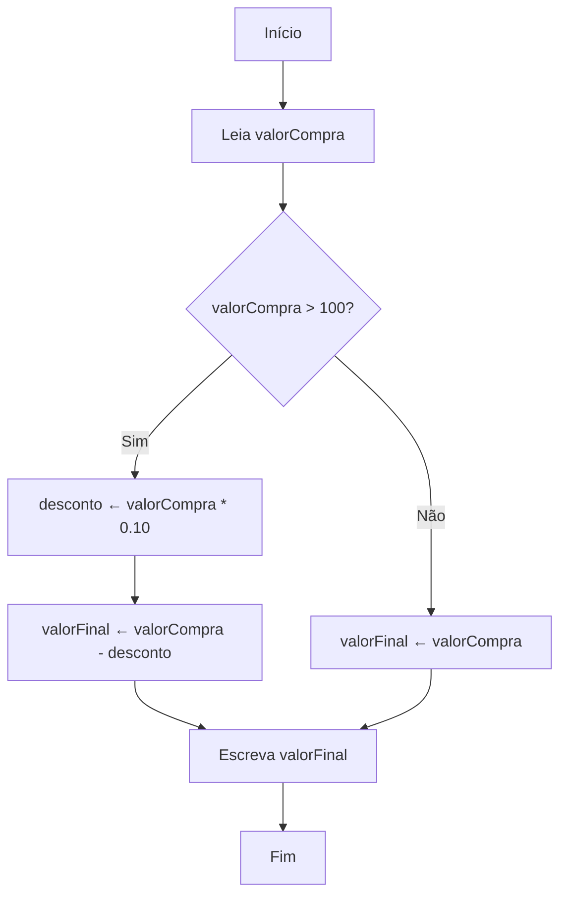
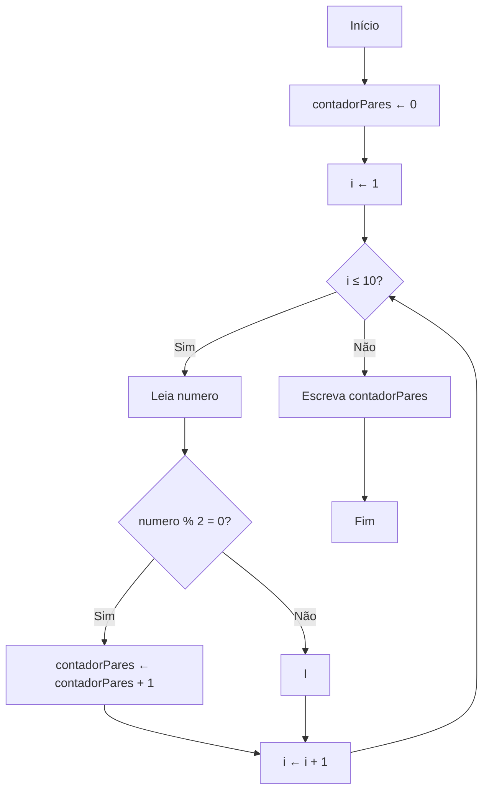
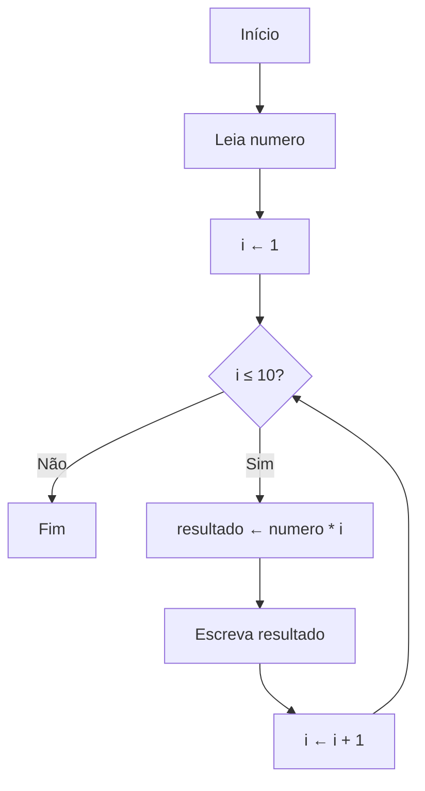

# Exercícios Resolvidos de Algoritmos para Automação de Tarefas Simples

A automação de tarefas simples é um dos principais objetivos ao aprender lógica de programação. Por meio de algoritmos, é possível criar soluções que facilitam o dia a dia, tornando processos repetitivos mais rápidos e eficientes. Nesta seção, apresentamos exercícios resolvidos que exemplificam como aplicar os conceitos fundamentais da lógica de programação para automatizar tarefas comuns. Os exemplos utilizam pseudocódigo e fluxogramas, facilitando a compreensão antes da implementação em uma linguagem de programação.

---

## Exercício 1: Cálculo Automático da Média de Notas

**Enunciado:**  
Crie um algoritmo que leia três notas de um aluno, calcule a média aritmética e informe se o aluno foi aprovado (média maior ou igual a 7) ou reprovado.

### Pseudocódigo

```plaintext
Início
    Leia nota1
    Leia nota2
    Leia nota3
    media ← (nota1 + nota2 + nota3) / 3
    Se media ≥ 7 então
        Escreva "Aprovado"
    Senão
        Escreva "Reprovado"
    FimSe
Fim
```

### Fluxograma

```mermaid
flowchart TD
    A[Início] --> B[Leia nota1]
    B --> C[Leia nota2]
    C --> D[Leia nota3]
    D --> E[Calcule média]
    E --> F{Média ≥ 7?}
    F -- Sim --> G[Escreva "Aprovado"]
    F -- Não --> H[Escreva "Reprovado"]
    G --> I[Fim]
    H --> I
```

---

## Exercício 2: Automação de Cálculo de Desconto

**Enunciado:**  
Desenvolva um algoritmo que leia o valor de uma compra e aplique um desconto de 10% caso o valor seja maior que R$ 100,00. Mostre o valor final a ser pago.

### Pseudocódigo

```plaintext
Início
    Leia valorCompra
    Se valorCompra > 100 então
        desconto ← valorCompra * 0.10
        valorFinal ← valorCompra - desconto
    Senão
        valorFinal ← valorCompra
    FimSe
    Escreva "Valor final: ", valorFinal
Fim
```

### Fluxograma



---

## Exercício 3: Contagem Automática de Números Pares

**Enunciado:**  
Elabore um algoritmo que leia 10 números e conte quantos deles são pares.

### Pseudocódigo

```plaintext
Início
    contadorPares ← 0
    Para i de 1 até 10 faça
        Leia numero
        Se numero % 2 = 0 então
            contadorPares ← contadorPares + 1
        FimSe
    FimPara
    Escreva "Quantidade de números pares: ", contadorPares
Fim
```

### Fluxograma



---

## Exercício 4: Geração Automática de Tabuada

**Enunciado:**  
Crie um algoritmo que leia um número e exiba a tabuada desse número de 1 a 10.

### Pseudocódigo

```plaintext
Início
    Leia numero
    Para i de 1 até 10 faça
        resultado ← numero * i
        Escreva numero, " x ", i, " = ", resultado
    FimPara
Fim
```

### Fluxograma



---

## Conclusão

Esses exercícios demonstram como a lógica de programação pode ser aplicada para automatizar tarefas simples do cotidiano. Ao praticar a resolução de problemas como cálculo de médias, descontos, contagem de elementos e geração de tabuadas, o iniciante desenvolve habilidades essenciais para criar algoritmos eficientes e práticos. O uso de pseudocódigo e fluxogramas facilita a visualização do raciocínio lógico, servindo como ponte para a implementação em qualquer linguagem de programação.

Continue praticando com variações desses exercícios para fortalecer sua base em lógica de programação e avançar no desenvolvimento de soluções cada vez mais complexas!