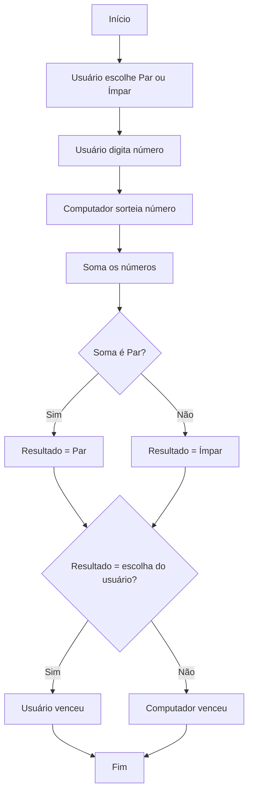
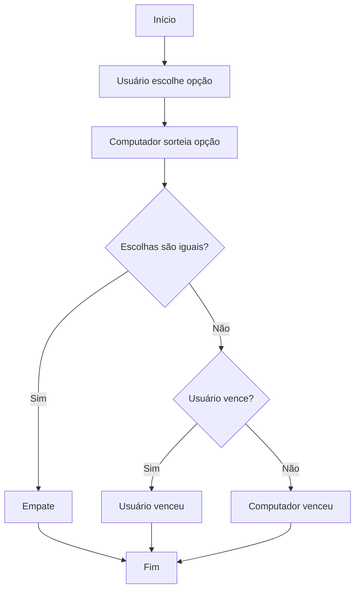

# Exercícios Resolvidos de Jogos Simples Utilizando Lógica

Neste tópico, vamos explorar exercícios resolvidos de jogos simples, aplicando os conceitos fundamentais de lógica de programação. A proposta é mostrar, passo a passo, como analisar o problema, estruturar o algoritmo e apresentar soluções utilizando pseudocódigo e fluxogramas. Esses exemplos são ideais para fixar o aprendizado e demonstrar como a lógica é a base para o desenvolvimento de jogos e programas interativos.

---

## 1. Jogo da Adivinhação

### Descrição do Problema

O computador escolhe um número aleatório entre 1 e 100. O jogador deve tentar adivinhar qual é esse número, recebendo dicas se o palpite está acima ou abaixo do valor correto. O jogo termina quando o jogador acerta.

### Análise e Solução

- **Entrada:** Palpite do jogador.
- **Processamento:** Comparar o palpite com o número sorteado e informar se é maior, menor ou igual.
- **Saída:** Mensagem de dica ou de acerto.

#### Pseudocódigo

```plaintext
INICIO
    sorteie um número entre 1 e 100 e armazene em NUMERO_SECRETO
    ENQUANTO (verdadeiro)
        peça ao usuário para digitar um PALPITE
        SE PALPITE < NUMERO_SECRETO
            escreva "Tente um número maior."
        SENÃO SE PALPITE > NUMERO_SECRETO
            escreva "Tente um número menor."
        SENÃO
            escreva "Parabéns! Você acertou!"
            pare o loop
        FIM SE
    FIM ENQUANTO
FIM
```

#### Fluxograma

```mermaid
flowchart TD
    A[Início] --> B[Sorteia número secreto]
    B --> C[Recebe palpite do usuário]
    C --> D{Palpite = Número Secreto?}
    D -- Não --> E{Palpite < Número Secreto?}
    E -- Sim --> F[Exibe "Tente um número maior"]
    E -- Não --> G[Exibe "Tente um número menor"]
    F --> C
    G --> C
    D -- Sim --> H[Exibe "Parabéns!"]
    H --> I[Fim]
```

---

## 2. Jogo de Par ou Ímpar

### Descrição do Problema

O usuário escolhe um número e se quer "par" ou "ímpar". O computador também escolhe um número. Soma-se os dois números e verifica-se se o resultado é par ou ímpar, determinando o vencedor.

### Análise e Solução

- **Entrada:** Número do usuário, escolha (par/ímpar), número do computador.
- **Processamento:** Soma dos números e verificação de paridade.
- **Saída:** Mensagem informando quem venceu.

#### Pseudocódigo

```plaintext
INICIO
    peça ao usuário para escolher PAR ou IMPAR
    peça ao usuário para digitar um número (NUM_USUARIO)
    sorteie um número para o computador (NUM_COMPUTADOR)
    SOMA = NUM_USUARIO + NUM_COMPUTADOR
    SE (SOMA % 2 == 0)
        RESULTADO = "PAR"
    SENÃO
        RESULTADO = "IMPAR"
    FIM SE
    SE (RESULTADO == escolha do usuário)
        escreva "Você venceu!"
    SENÃO
        escreva "O computador venceu!"
    FIM SE
FIM
```

#### Fluxograma



---

## 3. Jogo de Pedra, Papel e Tesoura

### Descrição do Problema

O usuário escolhe entre pedra, papel ou tesoura. O computador faz o mesmo. O programa compara as escolhas e determina o vencedor de acordo com as regras do jogo.

### Análise e Solução

- **Entrada:** Escolha do usuário e do computador.
- **Processamento:** Comparação das escolhas.
- **Saída:** Mensagem informando o vencedor ou empate.

#### Pseudocódigo

```plaintext
INICIO
    peça ao usuário para escolher: 1-Pedra, 2-Papel, 3-Tesoura
    sorteie a escolha do computador (1, 2 ou 3)
    SE (escolha do usuário == escolha do computador)
        escreva "Empate!"
    SENÃO SE (usuário escolheu Pedra E computador escolheu Tesoura) OU
              (usuário escolheu Papel E computador escolheu Pedra) OU
              (usuário escolheu Tesoura E computador escolheu Papel)
        escreva "Você venceu!"
    SENÃO
        escreva "O computador venceu!"
    FIM SE
FIM
```

#### Fluxograma



---

## Conclusão

Esses exemplos mostram como a lógica de programação é aplicada na criação de jogos simples. Ao praticar a análise do problema, a estruturação do algoritmo e a implementação com pseudocódigo e fluxogramas, você desenvolve habilidades essenciais para resolver desafios mais complexos no futuro. Exercite criando variações desses jogos ou implementando-os em uma linguagem de programação de sua escolha!
```
