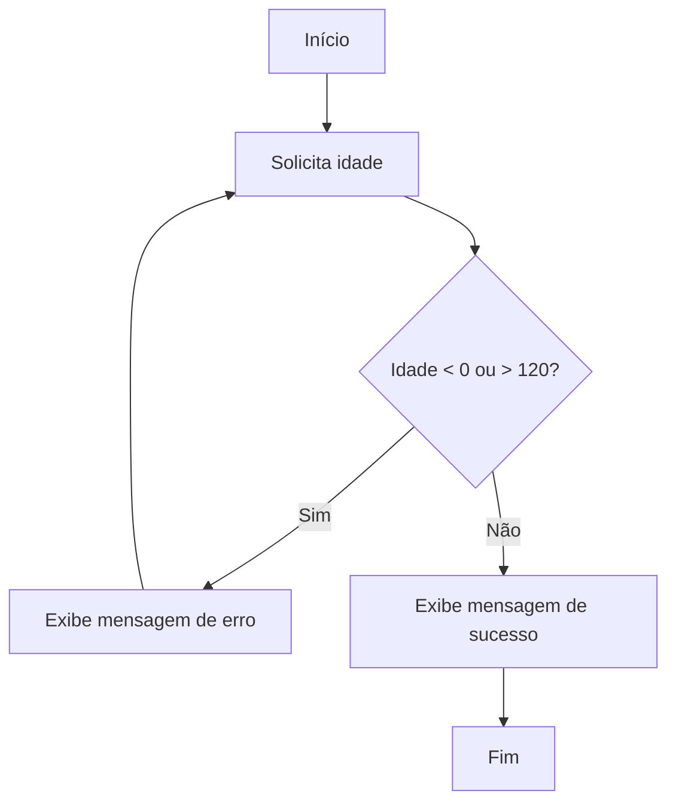

# Exercícios Resolvidos de Validação de Dados de Entrada

A validação de dados de entrada é uma etapa fundamental na lógica de programação. Ela garante que os dados fornecidos pelo usuário estejam corretos e dentro dos parâmetros esperados antes de serem processados pelo algoritmo. Isso evita erros, comportamentos inesperados e aumenta a confiabilidade do programa.

Neste tópico, apresentamos exercícios resolvidos que abordam diferentes situações de validação de dados de entrada, utilizando pseudocódigo e fluxogramas para facilitar o entendimento.

---

## Exercício 1: Validação de Idade

**Enunciado:**  
Solicite ao usuário que informe sua idade. O programa deve aceitar apenas valores inteiros entre 0 e 120. Caso o valor informado seja inválido, solicite novamente até que um valor válido seja fornecido.

### Pseudocódigo

```plaintext
Início
    Faça
        Escreva("Informe sua idade: ")
        Leia(idade)
        Se idade < 0 ou idade > 120 então
            Escreva("Idade inválida. Tente novamente.")
        FimSe
    Enquanto idade < 0 ou idade > 120
    Escreva("Idade registrada com sucesso: ", idade)
Fim
```

### Fluxograma



---

## Exercício 2: Validação de Nota Escolar

**Enunciado:**  
Peça ao usuário para digitar uma nota escolar. O valor deve ser um número real entre 0,0 e 10,0. Caso contrário, repita a solicitação.

### Pseudocódigo

```plaintext
Início
    Faça
        Escreva("Digite a nota (0,0 a 10,0): ")
        Leia(nota)
        Se nota < 0.0 ou nota > 10.0 então
            Escreva("Nota inválida. Digite novamente.")
        FimSe
    Enquanto nota < 0.0 ou nota > 10.0
    Escreva("Nota registrada: ", nota)
Fim
```

---

## Exercício 3: Validação de Opção de Menu

**Enunciado:**  
Apresente um menu com três opções (1 - Cadastrar, 2 - Consultar, 3 - Sair). O usuário deve escolher uma opção válida. Caso contrário, o menu deve ser exibido novamente.

### Pseudocódigo

```plaintext
Início
    Faça
        Escreva("Menu:")
        Escreva("1 - Cadastrar")
        Escreva("2 - Consultar")
        Escreva("3 - Sair")
        Escreva("Escolha uma opção: ")
        Leia(opcao)
        Se opcao < 1 ou opcao > 3 então
            Escreva("Opção inválida. Tente novamente.")
        FimSe
    Enquanto opcao < 1 ou opcao > 3
    Escreva("Opção escolhida: ", opcao)
Fim
```

---

## Exercício 4: Validação de Senha

**Enunciado:**  
Solicite ao usuário que digite uma senha. A senha deve ter pelo menos 6 caracteres. Caso contrário, solicite novamente.

### Pseudocódigo

```plaintext
Início
    Faça
        Escreva("Digite uma senha (mínimo 6 caracteres): ")
        Leia(senha)
        Se comprimento(senha) < 6 então
            Escreva("Senha muito curta. Tente novamente.")
        FimSe
    Enquanto comprimento(senha) < 6
    Escreva("Senha registrada com sucesso.")
Fim
```

---

## Dicas e Boas Práticas

- Sempre valide os dados de entrada antes de processá-los.
- Informe claramente ao usuário quais são os critérios de validação.
- Utilize estruturas de repetição (`enquanto`, `faça-enquanto`) para garantir que apenas dados válidos sejam aceitos.
- Em aplicações reais, combine validação de tipo (números, textos) com validação de faixa de valores.

---

## Conclusão

A validação de dados de entrada é um dos primeiros desafios práticos na lógica de programação. Com a prática desses exercícios, o iniciante desenvolve a habilidade de prever possíveis erros e garantir que o programa funcione corretamente, independentemente das entradas fornecidas pelo usuário. Essa competência é essencial para a construção de sistemas robustos e confiáveis.