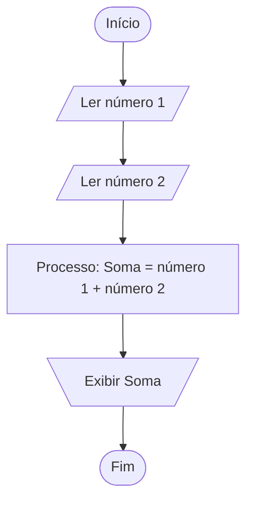

# Fluxogramas Básicos: Representação Visual de Algoritmos

A lógica de programação é fundamental para o desenvolvimento de software, e uma das ferramentas mais importantes para representar e entender algoritmos é o **fluxograma**. Neste tópico, você aprenderá o que são fluxogramas, para que servem, quais são seus principais símbolos e como utilizá-los para representar algoritmos de forma clara e eficiente.

---

## O que é um Fluxograma?

Um **fluxograma** é uma representação gráfica de um algoritmo ou processo. Ele utiliza símbolos padronizados para ilustrar, de maneira sequencial, as etapas necessárias para a resolução de um problema. Por meio de setas e formas geométricas, o fluxograma mostra o fluxo de execução das instruções, facilitando a visualização e compreensão do algoritmo.

---

## Por que Utilizar Fluxogramas?

Os fluxogramas são amplamente utilizados na programação e em outras áreas para:

- **Visualizar o fluxo de um algoritmo** antes de implementá-lo em uma linguagem de programação.
- **Identificar erros lógicos** e pontos de melhoria no processo.
- **Facilitar a comunicação** entre membros de uma equipe, especialmente para quem está começando a programar.
- **Documentar processos** de forma clara e padronizada.

---

## Principais Símbolos de Fluxogramas

Os fluxogramas utilizam símbolos padronizados pela norma ISO 5807. Abaixo estão os principais:

| Símbolo | Nome                | Função                                                                 |
|---------|---------------------|------------------------------------------------------------------------|
|  | Terminal (Início/Fim)   | Indica o início ou o fim do algoritmo.                                |
|  | Processo                | Representa uma operação ou instrução, como um cálculo ou atribuição.   |
|  | Entrada/Saída           | Indica uma entrada de dados (leitura) ou saída (exibição de dados).    |
|  | Decisão                 | Representa um ponto de decisão, como uma condição (if/else).           |
|  | Seta (Fluxo de Controle) | Indica a direção do fluxo do algoritmo.                                |

> **Observação:** Os símbolos podem variar levemente conforme o padrão adotado, mas a lógica permanece a mesma.

---

## Como Montar um Fluxograma

Para criar um fluxograma básico, siga estes passos:

1. **Defina o problema**: Entenda claramente o que o algoritmo deve resolver.
2. **Liste as etapas**: Escreva, em ordem, as ações necessárias para resolver o problema.
3. **Escolha os símbolos adequados**: Para cada etapa, utilize o símbolo correspondente.
4. **Conecte os símbolos**: Use setas para indicar o fluxo de execução.
5. **Revise**: Certifique-se de que o fluxograma está claro e cobre todos os casos possíveis.

---

## Exemplo Prático: Fluxograma para Somar Dois Números

Vamos criar um fluxograma simples para somar dois números e exibir o resultado.

**Passos do algoritmo:**
1. Início
2. Ler o primeiro número
3. Ler o segundo número
4. Somar os dois números
5. Exibir o resultado
6. Fim

**Fluxograma:**

---

## Dicas para Criar Bons Fluxogramas

- **Seja objetivo**: Use frases curtas e claras dentro dos símbolos.
- **Mantenha o fluxo de cima para baixo ou da esquerda para a direita**.
- **Evite cruzamento de setas** para não confundir o leitor.
- **Utilize símbolos padronizados** para facilitar a compreensão.

---

## Conclusão

Os fluxogramas são ferramentas essenciais para quem está começando a programar. Eles ajudam a visualizar e organizar o pensamento lógico, tornando a transição para o código muito mais simples. Ao dominar a criação de fluxogramas, você estará mais preparado para analisar problemas, estruturar soluções e desenvolver algoritmos eficientes.

> **Pratique:** Tente criar fluxogramas para tarefas do dia a dia, como preparar um café ou organizar uma rotina. Isso ajudará a desenvolver seu raciocínio lógico e a se familiarizar com a ferramenta.

---

**Referências:**
- Pressman, R. S. (2016). Engenharia de Software.
- Sebesta, R. W. (2010). Conceitos de Linguagens de Programação.
- ISO 5807:1985 - Information processing — Documentation symbols and conventions for data, program and system flowcharts, program network charts and system resources charts.

---

**Próximo passo:** Após entender fluxogramas, avance para a escrita de pseudocódigo, outra ferramenta fundamental para a lógica de programação!