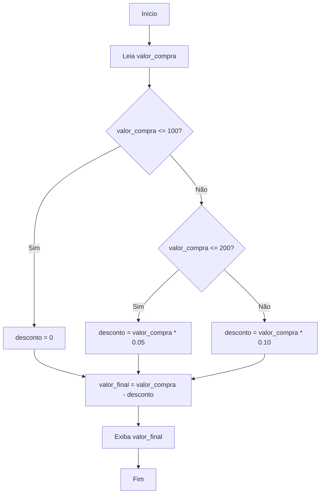

# Exercícios de Lógica para Tomada de Decisão: Calculadora de Descontos

A tomada de decisão é um dos pilares da lógica de programação. Ela permite que programas escolham diferentes caminhos de execução com base em condições específicas. Um dos exemplos mais comuns e práticos desse conceito é a **calculadora de descontos**, frequentemente utilizada em sistemas de vendas e comércio eletrônico.

Neste tópico, vamos explorar como criar algoritmos que simulam a aplicação de descontos em compras, utilizando estruturas de decisão como `if`, `else if` e `else`. Além disso, propomos exercícios para fixação do conteúdo.

---

## 1. Entendendo o Problema

Imagine que você trabalha em uma loja e precisa criar um sistema simples para calcular o valor final de uma compra, aplicando descontos conforme o valor total gasto pelo cliente. As regras de desconto são as seguintes:

- Compras até R$ 100,00: **sem desconto**
- Compras entre R$ 100,01 e R$ 200,00: **5% de desconto**
- Compras acima de R$ 200,00: **10% de desconto**

O objetivo é receber o valor da compra, calcular o desconto (se houver) e exibir o valor final a ser pago.

---

## 2. Pseudocódigo da Solução

Antes de implementar em uma linguagem de programação, é importante estruturar o raciocínio em **pseudocódigo**:

```
Início
    Leia valor_compra
    Se valor_compra <= 100
        desconto = 0
    Senão se valor_compra <= 200
        desconto = valor_compra * 0.05
    Senão
        desconto = valor_compra * 0.10
    FimSe
    valor_final = valor_compra - desconto
    Escreva "Valor final a pagar: ", valor_final
Fim
```

---

## 3. Fluxograma

Visualizar o fluxo de decisão ajuda a entender o caminho que o algoritmo percorre:



---

## 4. Exemplo Prático

Vamos aplicar o algoritmo a um exemplo real:

- **Valor da compra:** R$ 150,00

**Passos:**
1. O valor está entre R$ 100,01 e R$ 200,00.
2. Aplica-se 5% de desconto: 150 * 0.05 = R$ 7,50
3. Valor final: 150 - 7,50 = **R$ 142,50**

---

## 5. Exercícios Propostos

### Exercício 1

**Enunciado:**  
Implemente um algoritmo que leia o valor de uma compra e calcule o desconto conforme as regras apresentadas acima. Exiba o valor do desconto e o valor final a ser pago.

### Exercício 2

**Enunciado:**  
Adapte o algoritmo para incluir uma nova regra:  
- Compras acima de R$ 500,00 recebem **15% de desconto**.

### Exercício 3

**Enunciado:**  
Peça ao usuário para informar se é cliente VIP. Clientes VIP recebem um desconto adicional de 5%, independentemente do valor da compra. Calcule e exiba o valor final.

---

## 6. Dicas e Boas Práticas

- **Clareza:** Use nomes de variáveis que representem bem o que armazenam, como `valor_compra`, `desconto`, `valor_final`.
- **Organização:** Separe as etapas do cálculo em blocos lógicos.
- **Reutilização:** Se o cálculo de desconto for usado em vários lugares, transforme-o em uma função (quando estiver programando em uma linguagem específica).

---

## 7. Conclusão

Exercícios como a calculadora de descontos são fundamentais para praticar a lógica de tomada de decisão. Eles simulam situações reais e ajudam a desenvolver o raciocínio necessário para resolver problemas computacionais. Ao dominar essas estruturas, você estará preparado para desafios mais complexos na programação.

---
```
