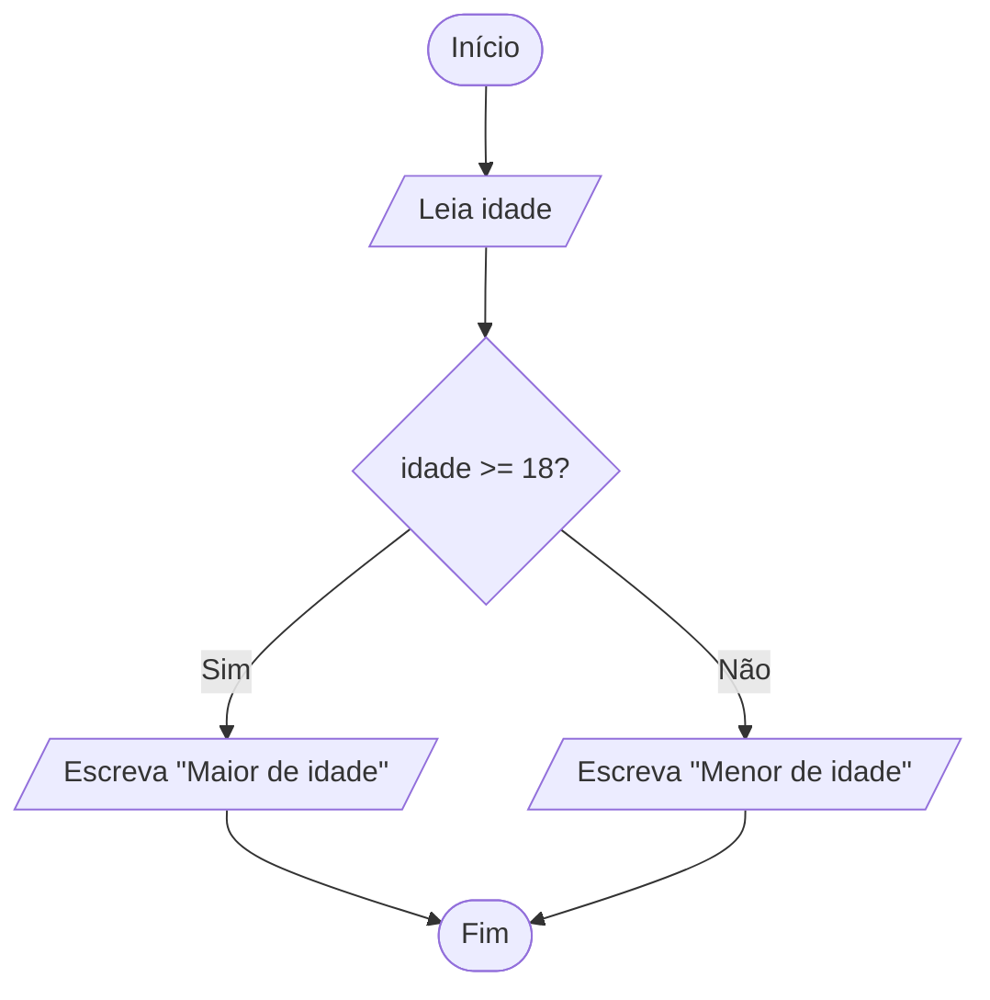

# Mapeamento de Comandos do Pseudocódigo para Símbolos de Fluxograma

A conversão de pseudocódigo para fluxograma é uma etapa fundamental no processo de desenvolvimento de algoritmos. Enquanto o pseudocódigo descreve, de forma textual e estruturada, os passos de uma solução, o fluxograma representa visualmente o fluxo de execução do algoritmo, facilitando a compreensão e a comunicação das ideias. Para realizar essa conversão, é essencial conhecer o mapeamento entre os comandos do pseudocódigo e os símbolos padrão utilizados em fluxogramas.

## Principais Símbolos de Fluxograma

Antes de mapear os comandos, é importante conhecer os principais símbolos utilizados em fluxogramas:

| Símbolo         | Nome                        | Função Principal                                  |
|-----------------|----------------------------|---------------------------------------------------|
|  | Terminal (Início/Fim)         | Indica o início ou fim do algoritmo               |
|  | Processo                     | Representa uma operação ou atribuição             |
|  | Entrada/Saída                 | Indica leitura de dados ou exibição de informações|
|   | Decisão                      | Representa uma escolha (condicional)              |
|  | Conector                     | Liga diferentes partes do fluxograma              |
|      | Seta (Fluxo de Controle)     | Indica a direção do fluxo de execução             |

## Mapeamento dos Comandos

A seguir, veja como os principais comandos do pseudocódigo são representados nos fluxogramas:

### 1. Início e Fim

- **Pseudocódigo:**  
  ```
  Início
  ...
  Fim
  ```
- **Fluxograma:**  
  Use o símbolo de **Terminal** para marcar o início e o fim do algoritmo.

---

### 2. Declaração de Variáveis e Atribuição

- **Pseudocódigo:**  
  ```
  inteiro idade
  idade ← 18
  ```
- **Fluxograma:**  
  Use o símbolo de **Processo** para declarar variáveis e realizar atribuições.

---

### 3. Entrada de Dados

- **Pseudocódigo:**  
  ```
  leia nome
  ```
- **Fluxograma:**  
  Use o símbolo de **Entrada/Saída** para representar a leitura de dados.

---

### 4. Saída de Dados

- **Pseudocódigo:**  
  ```
  escreva "Olá, mundo!"
  ```
- **Fluxograma:**  
  Use o símbolo de **Entrada/Saída** para representar a exibição de informações.

---

### 5. Estruturas de Decisão (Condicionais)

- **Pseudocódigo:**  
  ```
  se idade >= 18 então
      escreva "Maior de idade"
  senão
      escreva "Menor de idade"
  fimse
  ```
- **Fluxograma:**  
  Use o símbolo de **Decisão** (losango) para representar a condição. As setas indicam os caminhos "Sim" e "Não", levando a diferentes processos ou saídas.

---

### 6. Estruturas de Repetição

#### a) Enquanto (While)

- **Pseudocódigo:**  
  ```
  enquanto contador < 10 faça
      escreva contador
      contador ← contador + 1
  fimenquanto
  ```
- **Fluxograma:**  
  Use o símbolo de **Decisão** para verificar a condição. O fluxo retorna ao início do laço enquanto a condição for verdadeira.

#### b) Para (For)

- **Pseudocódigo:**  
  ```
  para i de 1 até 5 faça
      escreva i
  fimpara
  ```
- **Fluxograma:**  
  Similar ao "enquanto", utilize o símbolo de **Decisão** para controlar o laço, incrementando a variável de controle a cada iteração.

#### c) Repita...Até (Do...While)

- **Pseudocódigo:**  
  ```
  repita
      leia valor
  até valor > 0
  ```
- **Fluxograma:**  
  O bloco de comandos é executado ao menos uma vez antes da verificação da condição, que é representada por um símbolo de **Decisão** após o bloco.

---

## Exemplo Prático

### Pseudocódigo

```plaintext
Início
    leia idade
    se idade >= 18 então
        escreva "Maior de idade"
    senão
        escreva "Menor de idade"
    fimse
Fim
```

### Fluxograma



---

## Dicas para a Conversão

- **Mantenha a ordem lógica:** O fluxo do fluxograma deve seguir a sequência do pseudocódigo.
- **Use conectores quando necessário:** Para fluxogramas grandes, utilize conectores para evitar cruzamento de linhas.
- **Seja claro e objetivo:** Utilize descrições curtas nos símbolos para facilitar a leitura.
- **Valide o fluxo:** Certifique-se de que todas as decisões e repetições estão corretamente representadas.

---

## Conclusão

O mapeamento correto dos comandos do pseudocódigo para os símbolos de fluxograma é essencial para criar representações visuais claras e precisas dos algoritmos. Essa habilidade facilita a análise, a comunicação e a implementação de soluções em qualquer linguagem de programação. Praticar essa conversão é um passo importante para quem está começando na lógica de programação.