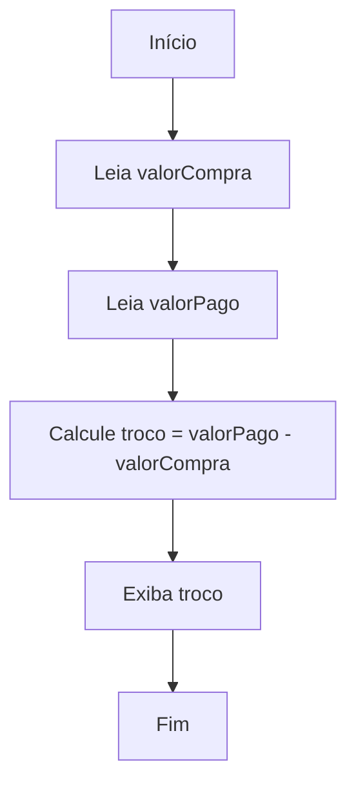

# Resolução de um Problema do Cotidiano: Cálculo de Troco com Variáveis e Operadores

A lógica de programação é uma ferramenta poderosa para resolver problemas do dia a dia. Um exemplo clássico é o cálculo de troco em uma compra, situação comum em qualquer comércio. Vamos entender como podemos utilizar **variáveis** e **operadores** para automatizar esse processo.

## Entendendo o Problema

Imagine que você está em uma loja e precisa calcular o troco a ser devolvido ao cliente após uma compra. Para isso, você precisa saber:

- O valor total da compra.
- O valor pago pelo cliente.

O troco é simplesmente a diferença entre o valor pago e o valor da compra.

## Definindo as Variáveis

Em programação, **variáveis** são espaços na memória do computador usados para armazenar valores temporários. Para este problema, podemos definir:

- `valorCompra`: armazena o valor total da compra.
- `valorPago`: armazena o valor entregue pelo cliente.
- `troco`: armazena o valor do troco a ser devolvido.

## Utilizando Operadores

Os **operadores aritméticos** permitem realizar cálculos matemáticos. Neste caso, usaremos o operador de subtração (`-`) para calcular o troco:

```
troco = valorPago - valorCompra
```

## Exemplo Prático em Pseudocódigo

Veja como ficaria a resolução deste problema em pseudocódigo:

```
Início
    Leia valorCompra
    Leia valorPago
    troco ← valorPago - valorCompra
    Escreva "O troco a ser devolvido é: ", troco
Fim
```

### Exemplo com Valores

Suponha que o valor da compra seja R$ 37,50 e o cliente pagou R$ 50,00:

- `valorCompra = 37.50`
- `valorPago = 50.00`
- `troco = 50.00 - 37.50 = 12.50`

O programa exibirá:  
**O troco a ser devolvido é: 12.50**

## Exemplo em Fluxograma



## Boas Práticas

- **Validação:** Antes de calcular o troco, é importante verificar se o valor pago é maior ou igual ao valor da compra.
- **Clareza:** Use nomes de variáveis que representem claramente o que armazenam.
- **Reutilização:** Este algoritmo pode ser adaptado para diferentes situações que envolvem cálculos similares.

## Exercício Proposto

Modifique o algoritmo para exibir uma mensagem de erro caso o valor pago seja menor que o valor da compra.

---

## Conclusão

Este exemplo mostra como variáveis e operadores são fundamentais para resolver problemas do cotidiano de forma lógica e eficiente. Compreender esses conceitos é o primeiro passo para criar programas úteis e funcionais, independentemente da linguagem de programação escolhida.
```
