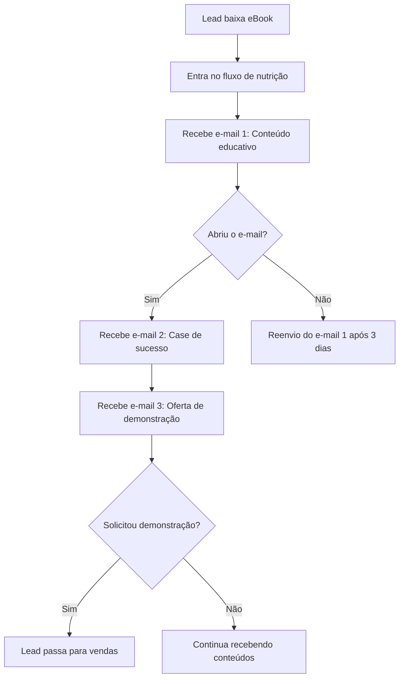

## Como criar fluxos automatizados para nutrição de leads

A nutrição de leads é uma das etapas mais importantes dentro do funil de vendas, pois permite educar, engajar e preparar potenciais clientes para a decisão de compra. Com a automação de marketing, é possível criar fluxos automatizados que entregam conteúdos relevantes no momento certo, aumentando as chances de conversão e otimizando o trabalho das equipes de marketing e vendas. A seguir, veja como criar fluxos automatizados eficientes para a nutrição de leads.

### 1. Defina os objetivos do fluxo de nutrição

Antes de criar qualquer automação, é fundamental ter clareza sobre o objetivo do fluxo. Pergunte-se:

- O que você deseja alcançar com esse fluxo? (Ex: educar sobre um produto, preparar para uma oferta, reengajar leads inativos)
- Em qual etapa do funil de vendas os leads estão?
- Qual ação final você espera que o lead realize? (Ex: baixar um material, solicitar contato, realizar uma compra)

### 2. Segmente sua base de leads

A segmentação é essencial para garantir que cada lead receba conteúdos alinhados ao seu perfil e estágio no funil. Utilize critérios como:

- Dados demográficos (idade, localização, cargo)
- Comportamento (páginas visitadas, materiais baixados, interações anteriores)
- Pontuação de lead scoring

Ferramentas de automação permitem criar listas dinâmicas que se atualizam automaticamente conforme os leads interagem com seus conteúdos.

### 3. Mapeie a jornada do lead

Entenda quais são as principais dúvidas, necessidades e objeções dos leads em cada etapa do funil. Com base nisso, planeje uma sequência de conteúdos que ajudem o lead a avançar na jornada de compra. Exemplos de conteúdos para nutrição:

- Topo do funil: eBooks, blog posts, infográficos, vídeos educativos
- Meio do funil: webinars, cases de sucesso, comparativos, demonstrações
- Fundo do funil: ofertas, trials, consultorias, depoimentos de clientes

### 4. Estruture o fluxo automatizado

Utilize sua ferramenta de automação para criar o fluxo, definindo:

- **Gatilhos de entrada:** O que faz o lead entrar no fluxo? (Ex: preencher um formulário, baixar um material, clicar em um link)
- **Sequência de envios:** Quantos e-mails ou mensagens serão enviados? Em qual intervalo de tempo?
- **Condições e ramificações:** O que acontece se o lead abrir ou não abrir um e-mail? Se clicar em um link, ele pode ser direcionado para outro fluxo ou receber um conteúdo diferente.
- **Critérios de saída:** Quando o lead deve sair do fluxo? (Ex: quando realiza a ação desejada, como solicitar contato comercial)

#### Exemplo de fluxo automatizado

### 5. Personalize as mensagens

A automação permite personalizar os envios com o nome do lead, empresa, cargo e outros dados relevantes. Além disso, adapte o conteúdo conforme o interesse demonstrado pelo lead, tornando a comunicação mais relevante e aumentando o engajamento.

### 6. Monitore e otimize os fluxos

Acompanhe métricas como taxas de abertura, cliques, respostas e conversão. Identifique pontos de melhoria, como e-mails com baixo desempenho ou etapas em que os leads abandonam o fluxo. Faça testes A/B com diferentes assuntos, formatos e horários de envio para otimizar os resultados.

### 7. Integre com o time de vendas

Quando um lead atinge o nível de maturidade desejado (por exemplo, solicita uma demonstração ou atinge determinada pontuação), a automação pode notificar automaticamente o time de vendas para que a abordagem seja feita no momento certo.

---

**Resumo:**  
Criar fluxos automatizados para nutrição de leads é uma estratégia fundamental para educar, engajar e preparar potenciais clientes para a compra. Com objetivos claros, segmentação adequada, conteúdos relevantes e monitoramento constante, é possível aumentar a eficiência do funil de vendas e potencializar os resultados do marketing digital.