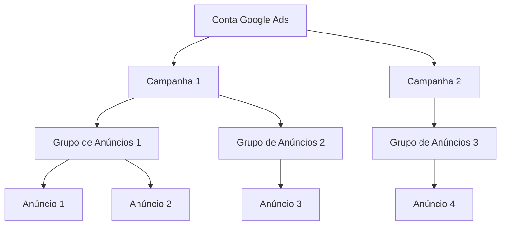

## Estrutura de uma Conta Google Ads: Campanhas, Grupos de Anúncios e Anúncios

O Google Ads é uma das principais ferramentas de publicidade online, permitindo que empresas de todos os portes alcancem seu público-alvo de forma segmentada e eficiente. Para obter bons resultados, é fundamental compreender a estrutura hierárquica de uma conta Google Ads, que se organiza em três níveis principais: **campanhas**, **grupos de anúncios** e **anúncios**. Cada nível possui funções e características específicas, que contribuem para o sucesso das estratégias de marketing digital.

---

### 1. Campanhas

A **campanha** é o nível mais alto da estrutura do Google Ads. É nela que você define os principais objetivos e configurações gerais da sua publicidade. Cada campanha pode ter um objetivo diferente, como gerar tráfego para o site, aumentar vendas, captar leads ou promover um aplicativo.

**Principais configurações de uma campanha:**
- **Tipo de campanha:** Rede de Pesquisa, Rede de Display, Shopping, Vídeo (YouTube), Apps, entre outros.
- **Orçamento diário:** Valor máximo que você está disposto a investir por dia.
- **Lances (bidding):** Estratégia de definição de lances, como CPC (custo por clique), CPM (custo por mil impressões) ou CPA (custo por aquisição).
- **Segmentação geográfica e idioma:** Defina onde e para quem seus anúncios serão exibidos.
- **Datas de início e término:** Controle o período de veiculação da campanha.

> **Dica:** Organize suas campanhas de acordo com os objetivos do negócio ou linhas de produtos/serviços. Isso facilita o gerenciamento e a análise de resultados.

---

### 2. Grupos de Anúncios

Dentro de cada campanha, você pode criar um ou mais **grupos de anúncios**. Eles servem para organizar os anúncios e as palavras-chave de acordo com temas ou produtos específicos. Cada grupo de anúncios deve ser focado em um conjunto restrito de palavras-chave ou segmentações, garantindo maior relevância e qualidade dos anúncios.

**Principais elementos de um grupo de anúncios:**
- **Palavras-chave:** Termos ou frases que ativam a exibição dos anúncios (na Rede de Pesquisa).
- **Segmentação:** Públicos-alvo, tópicos, canais ou interesses (na Rede de Display e YouTube).
- **Lances específicos:** Possibilidade de ajustar lances para determinados grupos de anúncios.

> **Exemplo:** Se você tem uma loja de calçados, pode criar uma campanha para "Calçados Femininos" e, dentro dela, grupos de anúncios para "Sapatos de Salto", "Tênis Feminino" e "Sandálias".

---

### 3. Anúncios

O nível mais detalhado da estrutura são os **anúncios** propriamente ditos. Eles são as peças criativas que serão exibidas ao público. Cada grupo de anúncios pode conter múltiplos anúncios, permitindo que o Google teste diferentes versões e otimize automaticamente a entrega para os melhores desempenhos.

**Principais tipos de anúncios:**
- **Anúncios de texto:** Utilizados na Rede de Pesquisa, compostos por títulos, descrições e URLs.
- **Anúncios gráficos:** Imagens ou banners para a Rede de Display.
- **Anúncios em vídeo:** Para o YouTube e parceiros de vídeo.
- **Anúncios responsivos:** Adaptam-se automaticamente a diferentes formatos e espaços.

**Boas práticas para anúncios:**
- Crie pelo menos 3 variações de anúncios por grupo para testar diferentes mensagens.
- Utilize palavras-chave relevantes no texto do anúncio.
- Inclua chamadas para ação claras (ex: "Compre agora", "Saiba mais").
- Direcione o usuário para uma página de destino relevante e otimizada.

---

### Visualizando a Estrutura

---

### Por que essa estrutura é importante?

- **Organização:** Facilita o gerenciamento de diferentes produtos, serviços ou públicos.
- **Relevância:** Permite criar anúncios mais alinhados com as intenções de busca dos usuários.
- **Otimização:** Ajuda a identificar rapidamente o que está funcionando e o que precisa ser ajustado.
- **Controle de orçamento:** Possibilita distribuir investimentos de acordo com prioridades e desempenho.

---

## Conclusão

Compreender a estrutura de uma conta Google Ads — campanhas, grupos de anúncios e anúncios — é essencial para criar estratégias eficazes, segmentadas e otimizadas. Uma boa organização permite maior controle sobre os resultados, facilita a análise de métricas e contribui para o sucesso das ações de marketing digital. Ao planejar suas campanhas, lembre-se de alinhar cada nível da estrutura aos objetivos do seu negócio e às necessidades do seu público-alvo.